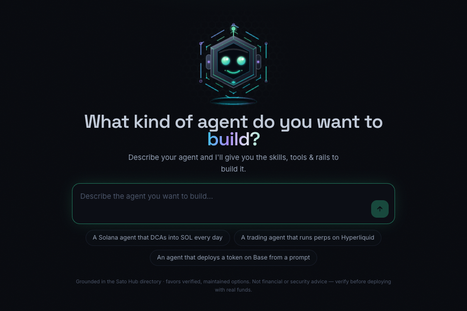

# Agent Architect — the Sato Hub Builder

**Describe the agent you want. Get the skills, tools & rails to build it.**

 

---

## What it does

You chat. It architects. Tell the Builder what your agent should do — in plain language — and it assembles a **grounded build plan** from the same live directory this index renders from: the frameworks, MCP servers, skills, wallets, and payment rails that actually fit the job, with the trade-offs called out.

Try the kind of thing people ask it:

> *"A Solana agent that DCAs into SOL every day"*
> *"A trading agent that runs perps on Hyperliquid"*
> *"An agent that deploys a token on Base from a prompt"*

## Why its answers hold up

The Builder isn't improvising from training data — it's grounded in the Sato Hub directory, live over MCP:

- **It favors verified, maintained options.** Sato Scores, observed liveness, and Docker-verified install specs steer every recommendation — the same signals you see in [this index](README.md).
- **It knows the whole stack**, not one vendor's corner: 260+ frameworks, MCPs, wallets, rails, and data tools, tracked and re-scored daily.
- **It hands you deploy specs**, not just names — install commands that were actually reproduced in the verification harness where the ✓ appears.
- **It's honest by rule.** Nothing gets presented as safe, audited, or profitable without evidence — and it will say so. Not financial or security advice; verify before deploying with real funds.

## From plan to running agent

1. **[Describe your agent →](https://satohub.ai/build?utm_source=github&utm_medium=index&utm_campaign=builder)** and get the architecture: components, rails, and the order to wire them.
2. Pull the pieces from the [directory](https://satohub.ai/directory?utm_source=github&utm_medium=index&utm_campaign=builder) — every listing links docs, repos, and its verification state.
3. Run it under supervision with [**SATO OS — Onchain Agent Mission Control**](SATO-OS.md): any model, any chain, your machine, the chain as referee.
4. Give it an identity: register an [**Agent Passport**](https://satohub.ai/agents?utm_source=github&utm_medium=index&utm_campaign=builder) — on-chain identity plus a verifiable track record.

### [**Build your agent → satohub.ai/build**](https://satohub.ai/build?utm_source=github&utm_medium=index&utm_campaign=builder)

Free to try · grounded in the live index · sign in to keep your build history

---

Built by [Sato Hub](https://satohub.ai?utm_source=github&utm_medium=index&utm_campaign=builder) — the agent builder hub for crypto. The Builder's supply layer is this index; the index's front door is the Builder. 𝕏 [Follow @SatoHub](https://x.com/satohub)
