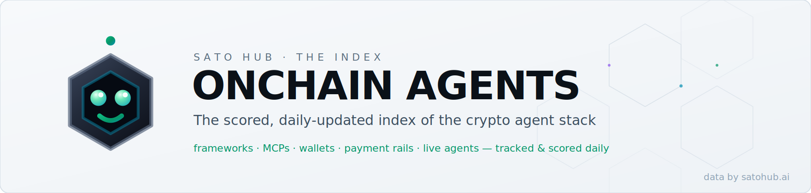
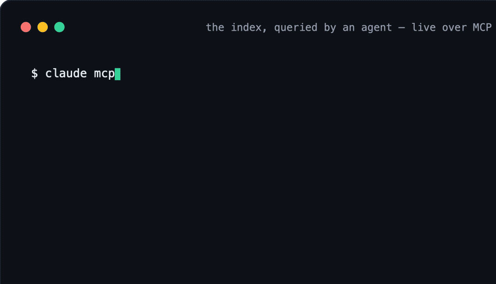

<div align="center">

<picture>
  <source media="(prefers-color-scheme: dark)" srcset="assets/banner-dark.svg">
  
</picture>

# Onchain Agents

**The scored, daily-updated index of the onchain agent stack** — every framework, MCP server, wallet, payment rail, data feed, and live agent, tracked and scored daily.

<picture>
  <source media="(prefers-color-scheme: dark)" srcset="assets/statband-dark.svg">
  
</picture>
**366 scored** (evidence-only Sato Score, every product) · **132 independently checked ✓** (62 installs reproduced in isolated containers, 36 evidence-reviewed, 34 live endpoints probed) — and growing.

<sub>Every product listing carries a Sato Score — a 0–100 measure of how open, active, and verifiable it is. Independently checked means we reproduced its documented install in an isolated container, reviewed its verification evidence, or probed its live endpoint ourselves.</sub>

[](https://x.com/SatoHub)

🔌 [**Query it from your agent** — MCP quickstart](docs/connect-mcp.md)

🛠️ [**Build your agent** — Agent Architect](BUILDER.md) · <sub>describe it in a sentence, get the stack → [satohub.ai/build](https://satohub.ai/build?utm_source=github&utm_medium=index&utm_campaign=onchain-agents)</sub>

🖥️ [**SATO OS — Onchain Agent Mission Control**](SATO-OS.md) · <sub>run it on any chain, any model, your machine</sub>

**[Index](#index)** | **[⬡ Top](#-top-of-the-index)** | **[📈 Movers](#-movers-7d)** | **[Live Agents](#live-agents-passport-registry)** | **[Standards](#standards--protocols)** | **[New this week](#new-this-week)** | **[Contribute](#contributing)** | **[satohub.ai ↗](https://satohub.ai?utm_source=github&utm_medium=index&utm_campaign=onchain-agents)**

</div>

---

<div align="center">

</div>

Built for agents as much as humans: a stable [`data/index.json`](data/index.json) (versioned schema), [`data/index.csv`](data/index.csv), [`llms.txt`](llms.txt), and a [live MCP endpoint](docs/connect-mcp.md) your agent can query directly.

```sh
curl -s https://satohub.ai/api/export/index.json | jq '.resources[0]'
```

## Legend

- **⬡ Score** — the [Sato Score](docs/sato-score.md): a 0–100 evidence-based measure of how **open, active, and verifiable** a project is. It is *not* a safety, quality, or returns grade ([NEUTRALITY.md](NEUTRALITY.md)). Click a score for the full report.
- **Activity** — observed liveness: 🟢 Active (≤30d) · 🟡 Recent (≤90d) · 🟠 Quiet (≤1y) · ⚪ Dormant.
- **★** — GitHub stars (refreshed daily).
- **✓** — install reproduced by our Docker verification harness ([methodology](docs/sato-score.md)).
- Every score links to the project's page on [satohub.ai](https://satohub.ai?utm_source=github&utm_medium=index&utm_campaign=onchain-agents) — full detail, provenance, and score history live there.
- Want the stack picked *for* you? [**The Builder**](BUILDER.md) turns "what my agent should do" into a grounded plan from this index.

## Index

- [Agent Frameworks](#agent-frameworks) (29)
- [MCP Servers](#mcp-servers) (134)
- [Wallet Infrastructure](#wallet-infrastructure) (25)
- [Trading & DeFi](#trading--defi) (41)
- [Data & APIs](#data--apis) (67)
- [Developer Tools](#developer-tools) (20)
- [Skills & Plugins](#skills--plugins) (27)
- [Launchpads & Marketplaces](#launchpads--marketplaces) (6)
- [Security](#security) (10)
- [Live Onchain Agents (directory)](#live-onchain-agents-directory) (6)
- [Research & Reference](#research--reference) (3)
- [Other](#other) (1)
- [⬡ Top of the index](#-top-of-the-index)
- [📈 Movers (7d)](#-movers-7d)
- [Live agents (Passport registry)](#live-agents-passport-registry)
- [Standards & protocols](#standards--protocols)
- [New this week](#new-this-week)
- [Community](#community)
- [Support the index](#support-the-index)

<a id="-top-of-the-index"></a>


<sub>Openness, activity, and verifiability — [not a safety grade](docs/sato-score.md).</sub>

| Name | Category | What it is | Chains | ⬡ Score | Activity | ★ | ✓ |
|---|---|---|---|---|---|---|---|
| [Raydium](https://github.com/raydium-io/raydium-sdk-V2) | Trading Tool | Solana AMM and DEX with an open-source TypeScript SDK V2 and public trade/routing API. | Solana | [⬡ 95](https://satohub.ai/resources/raydium?utm_source=github&utm_medium=index&utm_campaign=onchain-agents) | 🟢 Active | ★ 349 | ✓ |
| [Drift Protocol](https://github.com/drift-labs/protocol-v2) | Trading Tool | Open-source Solana perpetual futures DEX with TypeScript and Python SDKs and a self-hosted HTTP gateway. | Solana | [⬡ 91](https://satohub.ai/resources/drift-protocol?utm_source=github&utm_medium=index&utm_campaign=onchain-agents) | 🟢 Active | ★ 395 | ✓ |
| [TradingAgents](https://github.com/TauricResearch/TradingAgents) | Agent Framework | An open-source multi-agent LLM framework that simulates a trading firm with analyst, trader, and… | — | [⬡ 88](https://satohub.ai/resources/tradingagents?utm_source=github&utm_medium=index&utm_campaign=onchain-agents) | 🟢 Active | ★ 91.7k |  |
| [Coinbase AgentKit](https://github.com/coinbase/agentkit) | Developer Tool | Coinbase's toolkit for giving AI agents wallets and the ability to take onchain actions. | Base, Ethereum, Multichain | [⬡ 88](https://satohub.ai/resources/coinbase-agentkit?utm_source=github&utm_medium=index&utm_campaign=onchain-agents) | 🟢 Active | ★ 1.2k | ✓ |
| [BlockRun MCP](https://github.com/BlockRunAI/blockrun-mcp) | MCP | MCP server giving AI agents live data — markets, crypto, research, X — billed per call via x402 micropayments. | Base, Solana | [⬡ 86](https://satohub.ai/resources/blockrun-mcp?utm_source=github&utm_medium=index&utm_campaign=onchain-agents) | 🟢 Active | ★ 471 | ✓ |
| [Trust Wallet Agent Kit (TWAK)](https://github.com/trustwallet/tw-agent-skills) | Wallet Infrastructure | Non-custodial toolkit from Trust Wallet (MCP server, CLI, and SDK) that lets AI agents read and transact… | Ethereum, Base, Solana +6 | [⬡ 86](https://satohub.ai/resources/trust-wallet-agent-kit?utm_source=github&utm_medium=index&utm_campaign=onchain-agents) | 🟢 Active | ★ 63 | ✓ |
| [World AgentKit](https://github.com/worldcoin/agentkit) | API / SDK | SDK from World (Tools for Humanity) that lets AI agents present a zero-knowledge proof a verified human… | Base | [⬡ 86](https://satohub.ai/resources/world-agentkit?utm_source=github&utm_medium=index&utm_campaign=onchain-agents) | 🟢 Active | ★ 19 | ✓ |
| [OpenClaw](https://github.com/openclaw/openclaw) | Agent Framework | Open-source self-hosted personal AI agent framework with a public skill registry (ClawHub) that runs across… | — | [⬡ 84](https://satohub.ai/resources/openclaw?utm_source=github&utm_medium=index&utm_campaign=onchain-agents) | 🟢 Active | ★ 383.4k |  |
| [Hermes Agent](https://github.com/NousResearch/hermes-agent) | Agent Framework | Open-source self-improving AI agent from Nous Research with a built-in learning loop and one-step migration… | — | [⬡ 84](https://satohub.ai/resources/hermes-agent?utm_source=github&utm_medium=index&utm_campaign=onchain-agents) | 🟢 Active | ★ 216.7k |  |
| [ElizaOS](https://github.com/elizaOS/eliza) | Agent Framework | Open-source TypeScript framework for building crypto-native multi-agent systems. | Solana, Ethereum, Base +1 | [⬡ 84](https://satohub.ai/resources/elizaos?utm_source=github&utm_medium=index&utm_campaign=onchain-agents) | 🟢 Active | ★ 18.7k | ✓ |
| [Fetch.ai uAgents](https://github.com/fetchai/uAgents) | Agent Framework | Python framework for lightweight autonomous agents with built-in crypto-economic features. | Cosmos, Ethereum | [⬡ 84](https://satohub.ai/resources/fetchai-uagents?utm_source=github&utm_medium=index&utm_campaign=onchain-agents) | 🟢 Active | ★ 1.6k | ✓ |
| [GOAT SDK](https://github.com/goat-sdk/goat) | Skill Repo | Crossmint's open-source library of onchain actions (tools) for AI agents across chains. | Ethereum, Base, Solana +1 | [⬡ 84](https://satohub.ai/resources/goat-sdk?utm_source=github&utm_medium=index&utm_campaign=onchain-agents) | 🟢 Active | ★ 1.0k | ✓ |
| [Jupiter](https://github.com/jup-ag) | Trading Tool | Solana swap aggregator that routes trades across DEXs via a widely used API and SDKs. | Solana | [⬡ 84](https://satohub.ai/resources/jupiter-aggregator?utm_source=github&utm_medium=index&utm_campaign=onchain-agents) | 🟢 Active | — | ✓ |
| [Olas (Autonolas)](https://github.com/valory-xyz) | Agent Framework | Network and framework for co-owned autonomous agent services operating onchain. | Ethereum, Gnosis, Base +1 | [⬡ 84](https://satohub.ai/resources/olas?utm_source=github&utm_medium=index&utm_campaign=onchain-agents) | 🟢 Active | — | ✓ |
| [Orca](https://github.com/orca-so/whirlpools) | Trading Tool | Solana concentrated-liquidity AMM (Whirlpools) with open-source TypeScript and Rust SDKs. | Solana | [⬡ 83](https://satohub.ai/resources/orca?utm_source=github&utm_medium=index&utm_campaign=onchain-agents) | 🟢 Active | ★ 536 |  |

**[⬆ Back to Index](#index)**

<a id="agent-frameworks"></a>


<sub>**29** entries · build & run agents — onchain-native frameworks and general harnesses · Related: [Skills & Plugins](#skills--plugins) · [Developer Tools](#developer-tools) · [Browse + filter on satohub.ai →](https://satohub.ai/directory?category=Agent%20Framework&utm_source=github&utm_medium=index&utm_campaign=onchain-agents)</sub>

| Name | What it is | Chains | ⬡ Score | Activity | ★ | ✓ |
|---|---|---|---|---|---|---|
| [TradingAgents](https://github.com/TauricResearch/TradingAgents) | An open-source multi-agent LLM framework that simulates a trading firm with analyst, trader, and… | — | [⬡ 88](https://satohub.ai/resources/tradingagents?utm_source=github&utm_medium=index&utm_campaign=onchain-agents) | 🟢 Active | ★ 91.7k |  |
| [OpenClaw](https://github.com/openclaw/openclaw) | Open-source self-hosted personal AI agent framework with a public skill registry (ClawHub) that runs across… | — | [⬡ 84](https://satohub.ai/resources/openclaw?utm_source=github&utm_medium=index&utm_campaign=onchain-agents) | 🟢 Active | ★ 383.4k |  |
| [Hermes Agent](https://github.com/NousResearch/hermes-agent) | Open-source self-improving AI agent from Nous Research with a built-in learning loop and one-step migration… | — | [⬡ 84](https://satohub.ai/resources/hermes-agent?utm_source=github&utm_medium=index&utm_campaign=onchain-agents) | 🟢 Active | ★ 216.7k |  |
| [ElizaOS](https://github.com/elizaOS/eliza) | Open-source TypeScript framework for building crypto-native multi-agent systems. | Solana, Ethereum, Base +1 | [⬡ 84](https://satohub.ai/resources/elizaos?utm_source=github&utm_medium=index&utm_campaign=onchain-agents) | 🟢 Active | ★ 18.7k | ✓ |
| [Fetch.ai uAgents](https://github.com/fetchai/uAgents) | Python framework for lightweight autonomous agents with built-in crypto-economic features. | Cosmos, Ethereum | [⬡ 84](https://satohub.ai/resources/fetchai-uagents?utm_source=github&utm_medium=index&utm_campaign=onchain-agents) | 🟢 Active | ★ 1.6k | ✓ |
| [Olas (Autonolas)](https://github.com/valory-xyz) | Network and framework for co-owned autonomous agent services operating onchain. | Ethereum, Gnosis, Base +1 | [⬡ 84](https://satohub.ai/resources/olas?utm_source=github&utm_medium=index&utm_campaign=onchain-agents) | 🟢 Active | — | ✓ |
| [Lucid Agents](https://github.com/daydreamsai/lucid-agents) | Commerce SDK for bootstrapping AI agents that can pay, sell, and transact onchain. | Base, Ethereum, Solana | [⬡ 81](https://satohub.ai/resources/lucid-agents?utm_source=github&utm_medium=index&utm_campaign=onchain-agents) | 🟢 Active | ★ 189 | ✓ |
| [OpenAI Codex](https://github.com/openai/codex) | OpenAI's agentic coding tool (CLI, IDE, and cloud) that runs agents and connects to MCP servers and skills. | — | [⬡ 80](https://satohub.ai/resources/openai-codex?utm_source=github&utm_medium=index&utm_campaign=onchain-agents) | 🟢 Active | ★ 98.3k |  |
| [Almanak](https://github.com/almanak-co/sdk) | An AI-agent framework and non-custodial vault protocol for designing, backtesting, and deploying automated… | Multichain, Ethereum, Arbitrum +8 | [⬡ 80](https://satohub.ai/resources/almanak?utm_source=github&utm_medium=index&utm_campaign=onchain-agents) | 🟢 Active | ★ 57 | ✓ |
| [Claude Code](https://github.com/anthropics/claude-code) | Anthropic's agentic command-line coding tool that runs agents and loads Agent Skills, including onchain… | — | [⬡ 76](https://satohub.ai/resources/claude-code?utm_source=github&utm_medium=index&utm_campaign=onchain-agents) | 🟢 Active | ★ 138.1k |  |
| [OpenServ](https://github.com/openserv-labs/sdk) | TypeScript SDK and platform for building, orchestrating, and monetizing collaborative AI agents. | Multichain | [⬡ 68](https://satohub.ai/resources/openserv?utm_source=github&utm_medium=index&utm_campaign=onchain-agents) | 🟠 Quiet | ★ 133 | ✓ |
| [IntentKit](https://github.com/crestalnetwork/intentkit) | Open-source, self-hosted framework for running collaborative clusters of onchain AI agents. | — | [⬡ 65](https://satohub.ai/resources/intentkit?utm_source=github&utm_medium=index&utm_campaign=onchain-agents) | 🟡 Recent | ★ 6.5k |  |
| [Arbitrum Vibekit](https://github.com/EmberAGI/arbitrum-vibekit) | Arbitrum-native, MCP-first agent framework with A2A and x402 support, backed by an Arbitrum Foundation grant… | Arbitrum | [⬡ 64](https://satohub.ai/resources/arbitrum-vibekit?utm_source=github&utm_medium=index&utm_campaign=onchain-agents) | 🟡 Recent | — |  |
| [Grok CLI](https://github.com/superagent-ai/grok-cli) | Open-source terminal coding agent for the xAI Grok API — community-built, not affiliated with xAI. | — | [⬡ 62](https://satohub.ai/resources/grok-cli?utm_source=github&utm_medium=index&utm_campaign=onchain-agents) | 🟡 Recent | ★ 3.1k |  |
| [IronClaw](https://github.com/nearai/ironclaw) | NEAR AI's open-source secure agent runtime that runs agent workloads inside hardware TEEs on NEAR AI Cloud. | Near | [⬡ 57](https://satohub.ai/resources/ironclaw-near-ai?utm_source=github&utm_medium=index&utm_campaign=onchain-agents) | 🟢 Active | — |  |
| [Injective Agents](https://github.com/InjectiveLabs/iAgent) | A platform for deploying autonomous AI trading agents on Injective with onchain identity, order-book trading… | Injective, Cosmos | [⬡ 55](https://satohub.ai/resources/injective-agents?utm_source=github&utm_medium=index&utm_campaign=onchain-agents) | ⚪ Dormant | ★ 46 |  |
| [GAME SDK (Virtuals Protocol)](https://github.com/game-by-virtuals/game-python) | Virtuals Protocol's official Python SDK for building autonomous agents with planning, worker, and function… | Base | [⬡ 54](https://satohub.ai/resources/game-sdk-virtuals?utm_source=github&utm_medium=index&utm_campaign=onchain-agents) | — | — | ✓ |
| [Warden Protocol](https://github.com/warden-protocol) | A Cosmos SDK Layer 1 with EVM compatibility positioned as a settlement and distribution layer for AI agents. | Cosmos, Ethereum, Base +2 | [⬡ 53](https://satohub.ai/resources/warden-protocol?utm_source=github&utm_medium=index&utm_campaign=onchain-agents) | — | — |  |
| [Daydreams](https://github.com/daydreamsai/daydreams) | Framework and tooling for building AI agents for onchain commerce. | — | [⬡ 51](https://satohub.ai/resources/daydreams?utm_source=github&utm_medium=index&utm_campaign=onchain-agents) | 🟠 Quiet | ★ 584 | ✓ |
| [listen (DeFAI toolkit)](https://github.com/piotrostr/listen) | Rust toolkit pairing the rig LLM framework with Solana trading primitives, including Jito bundle submission. | Solana | [⬡ 50](https://satohub.ai/resources/listen-rs?utm_source=github&utm_medium=index&utm_campaign=onchain-agents) | — | — |  |
| [Wayfinder](https://wayfinder.ai) | Omnichain protocol that lets AI agents navigate blockchains and execute transactions via natural-language… | Multichain, Arbitrum, Base +1 | [⬡ 48](https://satohub.ai/resources/wayfinder-protocol?utm_source=github&utm_medium=index&utm_campaign=onchain-agents) | — | — |  |
| [Starknet Agentic](https://github.com/keep-starknet-strange/starknet-agentic) | Official Starknet-ecosystem infra for self-custodial agents: Cairo contracts, MCP/A2A runtimes, and… | Starknet | [⬡ 48](https://satohub.ai/resources/starknet-agentic?utm_source=github&utm_medium=index&utm_campaign=onchain-agents) | 🟡 Recent | — |  |
| [Snak (Starknet Agent Kit)](https://github.com/KasarLabs/snak) | NestJS-based toolkit for building AI agents that interact with Starknet, supporting multiple LLM providers. | Starknet | [⬡ 42](https://satohub.ai/resources/snak-starknet-agent-kit?utm_source=github&utm_medium=index&utm_campaign=onchain-agents) | 🟠 Quiet | — |  |
| [Ping Agent Kit](https://github.com/PingAIFun/ping-agent-kit) | Open-source Solana agent-integration kit with a plugin architecture spanning tokens, NFTs, DeFi, and Blinks. | Solana | [⬡ 42](https://satohub.ai/resources/ping-agent-kit?utm_source=github&utm_medium=index&utm_campaign=onchain-agents) | — | — |  |
| [LumoKit](https://github.com/Lumo-Labs-AI/lumokit) | Lightweight AI toolkit framework offering on-chain actions and research abilities for Solana. | Solana | [⬡ 42](https://satohub.ai/resources/lumokit?utm_source=github&utm_medium=index&utm_campaign=onchain-agents) | — | — |  |
| [Cambrian Agent Kit](https://github.com/CambrianAgents/sei-agent-kit) | TypeScript SDK giving AI agents direct access to Sei DeFi protocols: swaps, lending, staking, and perps. | Sei | [⬡ 42](https://satohub.ai/resources/sei-agent-kit?utm_source=github&utm_medium=index&utm_campaign=onchain-agents) | — | — |  |
| [Manus](https://manus.im) | General-purpose autonomous AI agent that executes multi-step tasks and can run onchain agent skills. | — | [⬡ 41](https://satohub.ai/resources/manus?utm_source=github&utm_medium=index&utm_campaign=onchain-agents) | — | — |  |
| [Spectral Syntax](https://www.spectrallabs.xyz/) | A no-code platform from Spectral Labs that turns natural-language prompts into autonomous onchain agents with… | Base, Ethereum | [⬡ 39](https://satohub.ai/resources/spectral-syntax?utm_source=github&utm_medium=index&utm_campaign=onchain-agents) | — | — |  |
| [Cod3x](https://www.cod3x.org/) | A DeFAI platform to create no-code AI agents that translate natural-language intent into onchain DeFi… | Multichain, Hyperliquid, Arbitrum | [⬡ 31](https://satohub.ai/resources/cod3x?utm_source=github&utm_medium=index&utm_campaign=onchain-agents) | — | — |  |

**[⬆ Back to Index](#index)**

<a id="mcp-servers"></a>


<sub>**134** entries · plug-in tool servers your agent calls over the Model Context Protocol · Related: [Skills & Plugins](#skills--plugins) · [Data & APIs](#data--apis) · [Browse + filter on satohub.ai →](https://satohub.ai/directory?category=MCP&utm_source=github&utm_medium=index&utm_campaign=onchain-agents)</sub>

<a id="mcp-servers-trading--defi"></a>
#### Trading & DeFi (50)

| Name | What it is | Chains | ⬡ Score | Activity | ★ | ✓ |
|---|---|---|---|---|---|---|
| [DexPaprika MCP Server](https://github.com/coinpaprika/dexpaprika-mcp) | Zero-config MCP access to DexPaprika's DEX data — tokens, liquidity pools, and OHLCV across 33 chains. | Multichain | [⬡ 81](https://satohub.ai/resources/dexpaprika-mcp?utm_source=github&utm_medium=index&utm_campaign=onchain-agents) | 🟢 Active | ★ 40 |  |
| [BNB Chain MCP](https://github.com/nirholas/bnbchain-mcp) | Developer MCP tools for AI crypto agents on BNB Chain: DeFi trading, DEX swaps, and contract deployment. | BNB Chain | [⬡ 81](https://satohub.ai/resources/bnbchain-mcp?utm_source=github&utm_medium=index&utm_campaign=onchain-agents) | 🟢 Active | ★ 32 | ✓ |
| [Binance MCP Server (community)](https://github.com/AnalyticAce/binance-mcp-server) | Community-built MCP server for Binance exchange data in trading-agent workflows. Not official Binance. | Multichain | [⬡ 79](https://satohub.ai/resources/binance-mcp?utm_source=github&utm_medium=index&utm_campaign=onchain-agents) | 🟢 Active | ★ 47 | ✓ |
| [Bybit Trading MCP](https://github.com/bybit-exchange/trading-mcp) | Official Bybit MCP for market data, trading, positions, wallet, and portfolio via REST and WebSocket. | Multichain | [⬡ 79](https://satohub.ai/resources/bybit-trading-mcp?utm_source=github&utm_medium=index&utm_campaign=onchain-agents) | 🟢 Active | ★ 19 | ✓ |
| [AIBTC MCP Server](https://github.com/aibtcdev/aibtc-mcp-server) | Bitcoin-native MCP server: BTC/STX wallets, L1 reads and transfers, Stacks, sBTC, and x402 payments. | Bitcoin | [⬡ 79](https://satohub.ai/resources/aibtc-mcp?utm_source=github&utm_medium=index&utm_campaign=onchain-agents) | 🟢 Active | ★ 10 | ✓ |
| [CoW MCP](https://github.com/krzysu/cow-mcp) | Community MCP server for CoW Protocol: quotes, token/chain lookup, trade history, and EIP-712 order payloads. | Multichain | [⬡ 79](https://satohub.ai/resources/cow-mcp?utm_source=github&utm_medium=index&utm_campaign=onchain-agents) | 🟡 Recent | ★ 0 |  |
| [AlgoVault Quant Signal MCP](https://github.com/AlgoVaultLabs/crypto-quant-signal-mcp) | MCP server for crypto-perps research signals, funding-rate arbitrage scans, and market-regime data. | Multichain | [⬡ 78](https://satohub.ai/resources/algovault-quant-signal-mcp?utm_source=github&utm_medium=index&utm_campaign=onchain-agents) | 🟢 Active | ★ 5 |  |
| [CoinGecko MCP](https://github.com/coingecko/coingecko-typescript) | Official CoinGecko MCP: hosted free/pro endpoints for live prices, market data, and on-chain DEX analytics. | Multichain | [⬡ 76](https://satohub.ai/resources/coingecko-mcp?utm_source=github&utm_medium=index&utm_campaign=onchain-agents) | 🟢 Active | ★ 56 |  |
| [Alchemy MCP Server](https://github.com/alchemyplatform/alchemy-mcp-server) | Official Alchemy MCP server exposing token, NFT, transaction, and wallet-execution tools to agents. | Multichain | [⬡ 75](https://satohub.ai/resources/alchemy-mcp?utm_source=github&utm_medium=index&utm_campaign=onchain-agents) | 🟢 Active | ★ 86 |  |
| [Bitget Agent Hub](https://github.com/Bitget-AI/agent_hub) | Official Bitget toolkit: MCP server, CLI, SDK, and skills for spot, futures, and account operations. | — | [⬡ 73](https://satohub.ai/resources/bitget-agent-hub?utm_source=github&utm_medium=index&utm_campaign=onchain-agents) | 🟢 Active | ★ 218 | ✓ |
| [Arcadia MCP](https://github.com/arcadia-finance/mcp-server) | Official Arcadia Finance MCP for concentrated-liquidity strategies on Uniswap and Aerodrome. | Base, Optimism | [⬡ 73](https://satohub.ai/resources/arcadia-mcp?utm_source=github&utm_medium=index&utm_campaign=onchain-agents) | 🟡 Recent | ★ 4 | ✓ |
| [Philidor MCP](https://github.com/Philidor-Labs/philidor-mcp) | Hosted MCP scoring risk across 700+ DeFi vaults on Morpho, Aave, Spark, Yearn, and Beefy for agent due… | Ethereum, Base, Arbitrum +3 | [⬡ 73](https://satohub.ai/resources/philidor-mcp?utm_source=github&utm_medium=index&utm_campaign=onchain-agents) | 🟠 Quiet | ★ 4 |  |
| [Web3 Research MCP](https://github.com/aaronjmars/web3-research-mcp) | Local, keyless MCP for structured crypto token research: web/news/image/video search plus CoinGecko and… | — | [⬡ 71](https://satohub.ai/resources/web3-research-mcp?utm_source=github&utm_medium=index&utm_campaign=onchain-agents) | 🟢 Active | ★ 161 | ✓ |
| [Gate MCP Server](https://github.com/gate/gate-mcp) | Official Gate MCP: hosted endpoints for market data, info, and news, plus OAuth-gated CEX trading and DEX… | Multichain | [⬡ 71](https://satohub.ai/resources/gate-mcp?utm_source=github&utm_medium=index&utm_campaign=onchain-agents) | 🟠 Quiet | ★ 27 |  |
| [TradingView MCP Server](https://github.com/atilaahmettaner/tradingview-mcp) | Community Python MCP for TradingView-style screening: 30+ technical-analysis tools across Binance, KuCoin… | Multichain | [⬡ 66](https://satohub.ai/resources/tradingview-mcp?utm_source=github&utm_medium=index&utm_campaign=onchain-agents) | 🟢 Active | ★ 3.5k |  |
| [Alpaca MCP Server](https://github.com/alpacahq/alpaca-mcp-server) | Official Alpaca MCP for stock, options, and crypto trading, portfolio and order management, and market data. | — | [⬡ 66](https://satohub.ai/resources/alpaca-mcp?utm_source=github&utm_medium=index&utm_campaign=onchain-agents) | 🟢 Active | ★ 853 |  |
| [Binance MCP (nirholas)](https://github.com/nirholas/binance-mcp) | Community Binance MCP with 478+ tools across spot, margin, futures, staking, NFT, and copy trading. | — | [⬡ 64](https://satohub.ai/resources/binance-mcp-nirholas?utm_source=github&utm_medium=index&utm_campaign=onchain-agents) | 🟢 Active | ★ 32 |  |
| [deBridge MCP](https://github.com/debridge-finance/debridge-mcp) | deBridge's official MCP for cross-chain and same-chain token swaps, fee estimation, and trade execution. | Multichain | [⬡ 64](https://satohub.ai/resources/debridge-mcp?utm_source=github&utm_medium=index&utm_campaign=onchain-agents) | 🟠 Quiet | ★ 31 |  |
| [Nansen MCP](https://www.nansen.ai) | Official Nansen MCP exposing smart-money and wallet-labeling data across 25+ chains. | Multichain | [⬡ 64](https://satohub.ai/resources/nansen-mcp?utm_source=github&utm_medium=index&utm_campaign=onchain-agents) | — | — |  |
| [DeFi Trading MCP](https://github.com/edkdev/defi-trading-mcp) | MCP server that turns an AI assistant into an autonomous DeFi trading agent. | Ethereum, Base, Polygon +5 | [⬡ 63](https://satohub.ai/resources/defi-trading-mcp?utm_source=github&utm_medium=index&utm_campaign=onchain-agents) | 🟡 Recent | ★ 51 | ✓ |
| [Sui MCP Server](https://github.com/ExpertVagabond/sui-mcp-server) | Community MCP server for Sui: wallet and session tools, coin/object/transaction queries, staking, SuiNS, and… | Sui | [⬡ 63](https://satohub.ai/resources/sui-mcp-server?utm_source=github&utm_medium=index&utm_campaign=onchain-agents) | 🟢 Active | ★ 1 |  |
| [Octav API MCP](https://github.com/Octav-Labs/octav-api-mcp) | Official Octav MCP exposing portfolio holdings, DeFi positions, NAV, and transaction history across 20+… | Multichain | [⬡ 63](https://satohub.ai/resources/octav-api-mcp?utm_source=github&utm_medium=index&utm_campaign=onchain-agents) | 🟢 Active | ★ 0 |  |
| [Pyth MCP](https://pyth.network) | Official hosted Pyth Network MCP server for price-feed discovery and real-time/historical market data. | Multichain | [⬡ 62](https://satohub.ai/resources/pyth-mcp?utm_source=github&utm_medium=index&utm_campaign=onchain-agents) | — | — |  |
| [CCXT MCP](https://github.com/lazy-dinosaur/ccxt-mcp) | CCXT-backed MCP server for multi-exchange market data, order books, balances, orders, and trade history. | Multichain | [⬡ 61](https://satohub.ai/resources/ccxt-mcp?utm_source=github&utm_medium=index&utm_campaign=onchain-agents) | 🟡 Recent | ★ 82 |  |
| [Algorand MCP](https://github.com/GoPlausible/algorand-mcp) | GoPlausible's Algorand MCP: agent wallets, transaction building/signing, TEAL, DEX aggregation, full… | — | [⬡ 61](https://satohub.ai/resources/algorand-mcp?utm_source=github&utm_medium=index&utm_campaign=onchain-agents) | 🟡 Recent | ★ 44 |  |
| [Crypto.com AI Tools](https://github.com/crypto-com/cdcx-cli) | Official Crypto.com CLI/MCP server for exchange trading, plus a hosted keyless market-data MCP. | — | [⬡ 61](https://satohub.ai/resources/crypto-com-ai?utm_source=github&utm_medium=index&utm_campaign=onchain-agents) | 🟡 Recent | ★ 21 |  |
| [Coinbase MCP Server](https://www.coinbase.com/blog/coinbase-for-agents) | Coinbase's remote MCP server — grant an AI agent scoped access to your Coinbase account to trade, make… | Base, Multichain | [⬡ 61](https://satohub.ai/resources/coinbase-mcp?utm_source=github&utm_medium=index&utm_campaign=onchain-agents) | — | — |  |
| [Haiku DeFi MCP](https://github.com/Haiku-Trading/haiku-mcp-server) | DeFi execution MCP: swaps, lending, bridges, yield discovery, and portfolio analysis with external wallet… | Multichain | [⬡ 60](https://satohub.ai/resources/haiku-defi-mcp?utm_source=github&utm_medium=index&utm_campaign=onchain-agents) | 🟡 Recent | ★ 1 |  |
| [Zerion MCP](https://developers.zerion.io/mcp) | Zerion's hosted MCP server exposing normalized wallet balances, DeFi positions, NFTs, and PnL across EVM… | Multichain | [⬡ 60](https://satohub.ai/resources/zerion-mcp?utm_source=github&utm_medium=index&utm_campaign=onchain-agents) | — | — |  |
| [LI.FI MCP](https://li.fi) | Official hosted LI.FI MCP server for read-only cross-chain swap quotes and route discovery. | Multichain | [⬡ 60](https://satohub.ai/resources/lifi-mcp?utm_source=github&utm_medium=index&utm_campaign=onchain-agents) | — | — |  |
| [BitGo MCP](https://www.bitgo.com) | BitGo's official Developer Portal MCP for natural-language search over its institutional wallet API docs. | Multichain | [⬡ 58](https://satohub.ai/resources/bitgo-mcp?utm_source=github&utm_medium=index&utm_campaign=onchain-agents) | — | — |  |
| [BlockBeats MCP](https://github.com/BlockBeatsOfficial/blockbeats-MCP) | Official BlockBeats MCP: crypto newsflashes, articles, market metrics, ETF flows, and macro signals. | Multichain | [⬡ 56](https://satohub.ai/resources/blockbeats-mcp?utm_source=github&utm_medium=index&utm_campaign=onchain-agents) | 🟠 Quiet | ★ 43 |  |
| [Sperax Crypto MCP](https://github.com/Sperax/sperax-crypto-mcp) | Official Sperax MCP for USDs/SPA protocol data: peg health, collateral, yield strategies, and vault risk on… | Arbitrum, BNB Chain | [⬡ 56](https://satohub.ai/resources/sperax-crypto-mcp?utm_source=github&utm_medium=index&utm_campaign=onchain-agents) | 🟠 Quiet | ★ 16 |  |
| [TradeRouter MCP](https://github.com/TradeRouter/trade-router-mcp) | MCP Registry-listed server for non-custodial Solana trading: swaps, limit, trailing, TWAP, DCA, and combo… | Solana | [⬡ 55](https://satohub.ai/resources/trade-router-mcp?utm_source=github&utm_medium=index&utm_campaign=onchain-agents) | 🟡 Recent | ★ 3 |  |
| [OpenSea MCP](https://opensea.io) | Official hosted OpenSea MCP: NFT, token, and wallet data plus swap quotes and mint actions for agents. | Multichain | [⬡ 52](https://satohub.ai/resources/opensea-mcp?utm_source=github&utm_medium=index&utm_campaign=onchain-agents) | — | — |  |
| [Polymarket MCP Server](https://github.com/caiovicentino/polymarket-mcp-server) | Community Polymarket MCP with 45 tools: market discovery, analysis, trading, portfolio, and WebSocket… | Polygon | [⬡ 50](https://satohub.ai/resources/polymarket-mcp?utm_source=github&utm_medium=index&utm_campaign=onchain-agents) | 🟠 Quiet | ★ 307 |  |
| [Universal Crypto MCP](https://github.com/nirholas/universal-crypto-mcp) | Plugin-based monorepo MCP: EVM+Solana wallets, DEX aggregation, x402 payments, CEX trading, market data… | Multichain | [⬡ 50](https://satohub.ai/resources/universal-crypto-mcp?utm_source=github&utm_medium=index&utm_campaign=onchain-agents) | 🟡 Recent | ★ 39 |  |
| [Heurist Mesh MCP](https://github.com/heurist-network/heurist-mesh-mcp-server) | MCP gateway to Heurist Mesh's 30+ hosted Web3 intelligence agents: token data, DEX pools, X analytics… | Multichain | [⬡ 49](https://satohub.ai/resources/heurist-mesh-mcp?utm_source=github&utm_medium=index&utm_campaign=onchain-agents) | 🟠 Quiet | ★ 63 |  |
| [Hummingbot MCP](https://github.com/hummingbot/mcp) | Official Hummingbot MCP server bridging agents to a Hummingbot API instance for multi-exchange trading. | — | [⬡ 49](https://satohub.ai/resources/hummingbot-mcp?utm_source=github&utm_medium=index&utm_campaign=onchain-agents) | 🟠 Quiet | ★ 49 |  |
| [Gate for AI](https://github.com/gate/gate-for-ai) | Gate.io's official AI infrastructure: CEX/DEX trading, wallet, news, and info MCP tools for agents. | Multichain | [⬡ 47](https://satohub.ai/resources/gate-for-ai?utm_source=github&utm_medium=index&utm_campaign=onchain-agents) | 🟠 Quiet | ★ 35 |  |
| [1inch Business MCP](https://business.1inch.com/1inch-mcp) | Official 1inch MCP: docs search, code examples, and Business API access for swaps, portfolio, and pricing. | Multichain | [⬡ 47](https://satohub.ai/resources/oneinch-mcp?utm_source=github&utm_medium=index&utm_campaign=onchain-agents) | — | — |  |
| [LunarCrush MCP](https://lunarcrush.com/products/lunarcrush-mcpserver) | Official LunarCrush MCP delivering real-time social sentiment, trends, and market signals to agents. | Multichain | [⬡ 47](https://satohub.ai/resources/lunarcrush-mcp?utm_source=github&utm_medium=index&utm_campaign=onchain-agents) | — | — |  |
| [Injective MCP](https://injective.com) | Official Injective MCP for natural-language queries and trading, incl. spot and perpetual futures. | Injective | [⬡ 45](https://satohub.ai/resources/injective-mcp?utm_source=github&utm_medium=index&utm_campaign=onchain-agents) | — | — |  |
| [Tether WDK MCP Toolkit](https://wdk.tether.io) | Official Tether toolkit exposing self-custodial WDK wallet ops — balances, transfers, swaps, bridging — as… | Multichain | [⬡ 45](https://satohub.ai/resources/tether-wdk-mcp?utm_source=github&utm_medium=index&utm_campaign=onchain-agents) | — | — |  |
| [QuantConnect MCP](https://www.quantconnect.com) | Official open-source QuantConnect MCP for quant project management, doc search, code checks, and backtesting. | — | [⬡ 45](https://satohub.ai/resources/quantconnect-mcp?utm_source=github&utm_medium=index&utm_campaign=onchain-agents) | — | — |  |
| [TON AgentKit MCP](https://ton.org) | TON's official @ton/mcp server for wallet operations, transfers, swaps, and NFT management on TON. | TON | [⬡ 37](https://satohub.ai/resources/ton-agentkit-mcp?utm_source=github&utm_medium=index&utm_campaign=onchain-agents) | — | — |  |
| [Jupiter MCP Server](https://github.com/kukapay/jupiter-mcp) | Open-source MCP servers that let AI agents execute Solana token swaps via Jupiter's Ultra aggregation API. | Solana | [⬡ 35](https://satohub.ai/resources/jupiter-mcp?utm_source=github&utm_medium=index&utm_campaign=onchain-agents) | ⚪ Dormant | ★ 24 |  |
| [Phantom MCP](https://help.phantom.com/hc/en-us/articles/49235725504147-Get-started-with-Phantom-MCP) | Phantom's MCP server that lets AI agents view addresses, sign transactions, swap, and transfer tokens across… | Solana, Ethereum, Bitcoin +2 | [⬡ 31](https://satohub.ai/resources/phantom-mcp?utm_source=github&utm_medium=index&utm_campaign=onchain-agents) | — | — |  |
| [Bitquery MCP](https://docs.bitquery.io/docs/mcp/mcp-server/) | Hosted MCP endpoint for natural-language queries over Bitquery's trading, OHLC, and token-economics datasets. | Multichain | [⬡ 25](https://satohub.ai/resources/bitquery-mcp?utm_source=github&utm_medium=index&utm_campaign=onchain-agents) | — | — |  |
| [Hive Intelligence Crypto MCP](https://hiveintelligence.xyz/crypto-mcp) | Hosted MCP exposing 375+ crypto tools spanning market data, DeFi analytics, security scans, and wallet data. | Multichain | [⬡ 25](https://satohub.ai/resources/hive-intelligence-mcp?utm_source=github&utm_medium=index&utm_campaign=onchain-agents) | — | — |  |

<a id="mcp-servers-data--analytics"></a>
#### Data & Analytics (41)

| Name | What it is | Chains | ⬡ Score | Activity | ★ | ✓ |
|---|---|---|---|---|---|---|
| [BlockRun MCP](https://github.com/BlockRunAI/blockrun-mcp) | MCP server giving AI agents live data — markets, crypto, research, X — billed per call via x402 micropayments. | Base, Solana | [⬡ 86](https://satohub.ai/resources/blockrun-mcp?utm_source=github&utm_medium=index&utm_campaign=onchain-agents) | 🟢 Active | ★ 471 | ✓ |
| [Boar Blockchain MCP](https://github.com/boar-network/blockchain-mcp) | Blockchain infrastructure MCP from Boar Network, with setup guides and free-tier access paths. | Multichain | [⬡ 81](https://satohub.ai/resources/boar-blockchain-mcp?utm_source=github&utm_medium=index&utm_campaign=onchain-agents) | 🟠 Quiet | ★ 12 |  |
| [Across MCP](https://github.com/across-protocol/mcp-server-across) | Official Across Protocol hosted MCP: docs search, chain data, and live bridge fees at mcp.across.to. | Multichain | [⬡ 80](https://satohub.ai/resources/across-mcp?utm_source=github&utm_medium=index&utm_campaign=onchain-agents) | 🟡 Recent | ★ 1 |  |
| [Nodit MCP Server](https://github.com/noditlabs/nodit-mcp-server) | Official Nodit MCP server giving agents normalized multi-chain blockchain data across EVM and non-EVM… | Multichain | [⬡ 79](https://satohub.ai/resources/nodit-mcp?utm_source=github&utm_medium=index&utm_campaign=onchain-agents) | 🟢 Active | ★ 23 | ✓ |
| [CoinStats MCP](https://github.com/CoinStatsHQ/coinstats-mcp) | Official hosted CoinStats MCP for portfolio, wallet, and market data across 120+ chains via OAuth. | Multichain | [⬡ 75](https://satohub.ai/resources/coinstats-mcp?utm_source=github&utm_medium=index&utm_campaign=onchain-agents) | 🟢 Active | ★ 15 |  |
| [Blockscout MCP Server](https://github.com/blockscout/mcp-server) | Wraps Blockscout explorer APIs so agents can query balances, tokens, NFTs, and contract data across chains. | Multichain | [⬡ 73](https://satohub.ai/resources/blockscout-mcp?utm_source=github&utm_medium=index&utm_campaign=onchain-agents) | 🟢 Active | ★ 42 |  |
| [MetaMask Embedded Wallets MCP](https://github.com/Web3Auth/web3auth-mcp) | Official Web3Auth MCP for integrating MetaMask Embedded Wallets: live SDK docs, examples, and type lookup. | Multichain | [⬡ 73](https://satohub.ai/resources/web3auth-mcp?utm_source=github&utm_medium=index&utm_campaign=onchain-agents) | 🟡 Recent | ★ 3 |  |
| [Celo MCP](https://github.com/celo-org/celo-mcp) | Official Celo MCP server for querying the Celo ecosystem, chain data, and developer workflows. | Ethereum | [⬡ 70](https://satohub.ai/resources/celo-mcp?utm_source=github&utm_medium=index&utm_campaign=onchain-agents) | 🟢 Active | ★ 4 |  |
| [Maestro MCP Server](https://github.com/maestro-org/maestro-mcp-server) | Official Maestro Bitcoin MCP: indexer, mempool, price, and node RPC data via hosted mainnet/testnet endpoints. | Bitcoin | [⬡ 69](https://satohub.ai/resources/maestro-mcp?utm_source=github&utm_medium=index&utm_campaign=onchain-agents) | 🟠 Quiet | ★ 22 |  |
| [Bankless Onchain MCP](https://github.com/bankless/onchain-mcp) | MCP server providing AI assistants read access to onchain data via the Bankless API. | Ethereum, Base, Multichain | [⬡ 67](https://satohub.ai/resources/bankless-onchain-mcp?utm_source=github&utm_medium=index&utm_campaign=onchain-agents) | ⚪ Dormant | ★ 24 | ✓ |
| [Insumer MCP Server](https://github.com/douglasborthwick-crypto/mcp-server-insumer) | MCP for condition-based access checks: signed boolean attestations across 37 chains without exposing balances. | Multichain | [⬡ 67](https://satohub.ai/resources/insumer-mcp?utm_source=github&utm_medium=index&utm_campaign=onchain-agents) | 🟡 Recent | ★ 0 | ✓ |
| [Allium MCP](https://www.allium.so) | Allium's official MCP for querying its multichain blockchain data warehouse via SQL over 80+ chains. | Multichain | [⬡ 66](https://satohub.ai/resources/allium-mcp?utm_source=github&utm_medium=index&utm_campaign=onchain-agents) | — | — |  |
| [Hedera MCP](https://github.com/ExpertVagabond/hedera-mcp) | Community MCP for Hedera: Mirror Node reads plus 73 build-only tools across accounts, HTS, HCS, EVM, and… | — | [⬡ 65](https://satohub.ai/resources/hedera-mcp?utm_source=github&utm_medium=index&utm_campaign=onchain-agents) | 🟡 Recent | ★ 0 | ✓ |
| [MCP Crypto Price](https://github.com/truss44/mcp-crypto-price) | MCP server exposing CoinCap-backed crypto pricing, market stats, and technical indicators as agent-callable… | Multichain | [⬡ 64](https://satohub.ai/resources/mcp-crypto-price?utm_source=github&utm_medium=index&utm_campaign=onchain-agents) | 🟢 Active | ★ 40 |  |
| [Vybe Solana MCP](https://github.com/vybenetwork/solana-mcp-vybe) | Hosted Solana MCP from Vybe Network: schema browsing plus live Solana API calls, no local deployment. | Solana | [⬡ 63](https://satohub.ai/resources/vybe-solana-mcp?utm_source=github&utm_medium=index&utm_campaign=onchain-agents) | 🟡 Recent | ★ 213 |  |
| [Bitcoin MCP (Bortlesboat)](https://github.com/Bortlesboat/bitcoin-mcp) | Zero-config Bitcoin data MCP: fees, mempool, blocks, transactions, mining, price, and supply. | Bitcoin | [⬡ 63](https://satohub.ai/resources/bitcoin-mcp?utm_source=github&utm_medium=index&utm_campaign=onchain-agents) | 🟠 Quiet | ★ 2 | ✓ |
| [CoinPaprika MCP](https://github.com/coinpaprika/coinpaprika-mcp) | Official CoinPaprika MCP: 30 tools for prices, tickers, OHLCV, and exchange data across 8,000+ coins. | Multichain | [⬡ 63](https://satohub.ai/resources/coinpaprika-mcp?utm_source=github&utm_medium=index&utm_campaign=onchain-agents) | 🟢 Active | ★ 0 |  |
| [Avalanche Builder Hub MCP](https://build.avax.network) | Ava Labs' read-only MCP exposing Builders Hub docs, code search, and Avalanche chain data to AI clients. | Avalanche | [⬡ 62](https://satohub.ai/resources/avalanche-mcp?utm_source=github&utm_medium=index&utm_campaign=onchain-agents) | — | — |  |
| [LayerZero Docs MCP](https://layerzero.network) | Official hosted LayerZero documentation MCP: real-time doc search via a single SearchLayerZero tool. | Multichain | [⬡ 62](https://satohub.ai/resources/layerzero-mcp?utm_source=github&utm_medium=index&utm_campaign=onchain-agents) | — | — |  |
| [Tari MCP Servers](https://github.com/tari-project/tari) | Official Minotari wallet and node MCP servers for local agent access to Tari blockchain data and transactions. | — | [⬡ 61](https://satohub.ai/resources/tari-mcp?utm_source=github&utm_medium=index&utm_campaign=onchain-agents) | 🟢 Active | ★ 495 |  |
| [Tatum Blockchain MCP](https://github.com/tatumio/blockchain-mcp) | Official Tatum MCP exposing blockchain data and RPC gateway access across 130+ networks. | Multichain | [⬡ 61](https://satohub.ai/resources/tatum-blockchain-mcp?utm_source=github&utm_medium=index&utm_campaign=onchain-agents) | 🟡 Recent | ★ 14 |  |
| [Crypto APIs MCP Servers](https://github.com/CryptoAPIs-io/cryptoapis-mcp-hub) | Official Crypto APIs MCP suite: hosted endpoint plus per-package servers for balances, blocks, txs, fees, and… | Multichain | [⬡ 61](https://satohub.ai/resources/cryptoapis-mcp?utm_source=github&utm_medium=index&utm_campaign=onchain-agents) | 🟠 Quiet | ★ 0 |  |
| [EVM MCP Server](https://github.com/mcpdotdirect/evm-mcp-server) | MCP server exposing 22 tools across 60+ EVM chains: balances, contracts, token transfers, ENS, block/tx data. | Multichain | [⬡ 60](https://satohub.ai/resources/evm-mcp-server?utm_source=github&utm_medium=index&utm_campaign=onchain-agents) | 🟡 Recent | ★ 378 | ✓ |
| [thirdweb AI](https://github.com/thirdweb-dev/ai) | Thirdweb's MCP toolkit bundling Nebula, Insight, Engine, and Storage for onchain agent building. | Multichain | [⬡ 58](https://satohub.ai/resources/thirdweb-ai?utm_source=github&utm_medium=index&utm_campaign=onchain-agents) | ⚪ Dormant | ★ 18 |  |
| [Hashnet MCP Server](https://github.com/hashgraph-online/hashnet-mcp-js) | Hashgraph Online MCP for agent discovery, chat, registration, workflows, and Hedera agent interactions. | — | [⬡ 51](https://satohub.ai/resources/hashnet-mcp?utm_source=github&utm_medium=index&utm_campaign=onchain-agents) | 🟡 Recent | ★ 12 |  |
| [CryptoQuant MCP](https://github.com/CryptoQuantOfficial/cryptoquant-mcp) | Official CryptoQuant MCP server exposing on-chain metrics like MVRV, SOPR, and exchange flows to agents. | Multichain | [⬡ 50](https://satohub.ai/resources/cryptoquant-mcp?utm_source=github&utm_medium=index&utm_campaign=onchain-agents) | 🟠 Quiet | ★ 6 | ✓ |
| [Memecoin Observatory MCP](https://github.com/tony-42069/solana-mcp) | Solana MCP server for memecoin launch detection, whale tracking, and rugpull risk scanning. | Solana | [⬡ 49](https://satohub.ai/resources/memecoin-observatory-mcp?utm_source=github&utm_medium=index&utm_campaign=onchain-agents) | 🟠 Quiet | ★ 24 |  |
| [Helius MCP](https://www.helius.dev) | Official Helius MCP server for Solana: wallet, asset, transaction, and chain-state tools via npm package. | Solana | [⬡ 47](https://satohub.ai/resources/helius-mcp?utm_source=github&utm_medium=index&utm_campaign=onchain-agents) | — | — | ✓ |
| [Polkadot MCP](https://github.com/shawntabrizi/polkadot-mcp) | Read-only Rust stdio MCP for Polkadot, Kusama, and parachains: accounts, governance, staking, and chain state. | — | [⬡ 47](https://satohub.ai/resources/polkadot-mcp?utm_source=github&utm_medium=index&utm_campaign=onchain-agents) | 🟠 Quiet | ★ 0 |  |
| [Sei MCP](https://www.sei.io) | Official Sei MCP: wallet/account management, SEI transfers, and ERC20/721/1155 token operations. | Sei | [⬡ 45](https://satohub.ai/resources/sei-mcp?utm_source=github&utm_medium=index&utm_campaign=onchain-agents) | — | — |  |
| [GoldRush MCP (Covalent)](https://goldrush.dev) | Covalent's official GoldRush MCP: 50+ tools for multichain wallet balances and token data. | Multichain | [⬡ 45](https://satohub.ai/resources/goldrush-mcp?utm_source=github&utm_medium=index&utm_campaign=onchain-agents) | — | — |  |
| [RWA Pipe MCP](https://github.com/rwapipe/mcp) | MCP server for tokenized real-world asset data: RWA token discovery, TVL/APY, issuer and chain filters, and… | Multichain | [⬡ 44](https://satohub.ai/resources/rwa-pipe-mcp?utm_source=github&utm_medium=index&utm_campaign=onchain-agents) | 🟡 Recent | ★ 0 |  |
| [Erigon MCP](https://erigon.tech) | Open-source MCP built into the Erigon Ethereum client, exposing 40+ read-only JSON-RPC and node-data tools. | Ethereum | [⬡ 41](https://satohub.ai/resources/erigon-mcp?utm_source=github&utm_medium=index&utm_campaign=onchain-agents) | — | — |  |
| [QuickNode MCP](https://www.quicknode.com/docs/build-with-ai/quicknode-mcp) | Official remote MCP for managing QuickNode blockchain endpoints, rate limits, security, and billing via… | Multichain | [⬡ 39](https://satohub.ai/resources/quicknode-mcp?utm_source=github&utm_medium=index&utm_campaign=onchain-agents) | — | — |  |
| [Chainbase MCP](https://chainbase.com) | Official hosted Chainbase MCP for token prices, holders, wallet balances, and NFT data via natural language. | Multichain | [⬡ 37](https://satohub.ai/resources/chainbase-mcp?utm_source=github&utm_medium=index&utm_campaign=onchain-agents) | — | — |  |
| [Messari MCP](https://messari.io) | Official hosted Messari MCP for crypto research: market data, on-chain metrics, and news across 40,000+… | Multichain | [⬡ 28](https://satohub.ai/resources/messari-mcp?utm_source=github&utm_medium=index&utm_campaign=onchain-agents) | — | — |  |
| [CoinMarketCap MCP](https://coinmarketcap.com/api/) | Official CoinMarketCap hosted MCP for quotes, technical analysis, on-chain metrics, and market data. | Multichain | [⬡ 27](https://satohub.ai/resources/coinmarketcap-mcp?utm_source=github&utm_medium=index&utm_campaign=onchain-agents) | — | — |  |
| [Dune MCP](https://dune.com) | Official Dune remote MCP for generating, running, and visualizing DuneSQL queries and dashboards from an… | Multichain | [⬡ 25](https://satohub.ai/resources/dune-mcp?utm_source=github&utm_medium=index&utm_campaign=onchain-agents) | — | — |  |
| [Birdeye MCP](https://birdeye.so) | Official hosted MCP for real-time and historical crypto market data across 8M+ tokens. | Multichain | [⬡ 25](https://satohub.ai/resources/birdeye-mcp?utm_source=github&utm_medium=index&utm_campaign=onchain-agents) | — | — |  |
| [Santiment MCP](https://santiment.net) | Official OAuth-backed Santiment MCP for on-chain, social, and financial crypto metrics. | Multichain | [⬡ 25](https://satohub.ai/resources/santiment-mcp?utm_source=github&utm_medium=index&utm_campaign=onchain-agents) | — | — |  |
| [Token Terminal MCP](https://tokenterminal.com) | Official hosted Token Terminal MCP with a research tool over onchain project/protocol financials. | Multichain | [⬡ 25](https://satohub.ai/resources/tokenterminal-mcp?utm_source=github&utm_medium=index&utm_campaign=onchain-agents) | — | — |  |

<a id="mcp-servers-payments"></a>
#### Payments (7)

| Name | What it is | Chains | ⬡ Score | Activity | ★ | ✓ |
|---|---|---|---|---|---|---|
| [MERX MCP](https://github.com/Hovsteder/merx-mcp) | TRON infrastructure MCP (hosted SSE + local stdio): energy/bandwidth prices, resource optimization, and… | Tron | [⬡ 81](https://satohub.ai/resources/merx-mcp?utm_source=github&utm_medium=index&utm_campaign=onchain-agents) | 🟠 Quiet | ★ 3 |  |
| [PayRam MCP](https://github.com/PayRam/payram-mcp) | PayRam's MCP server for self-hosted crypto payments: hosted endpoints and agent payment workflows. | Multichain | [⬡ 71](https://satohub.ai/resources/payram-mcp?utm_source=github&utm_medium=index&utm_campaign=onchain-agents) | 🟡 Recent | ★ 156 |  |
| [Lightning Wallet MCP](https://github.com/lightningfaucet/lightning-wallet-mcp) | Bitcoin Lightning wallet MCP and CLI for agent payments: invoices, sends, and L402 support. | Bitcoin | [⬡ 70](https://satohub.ai/resources/lightning-wallet-mcp?utm_source=github&utm_medium=index&utm_campaign=onchain-agents) | 🟢 Active | ★ 8 |  |
| [x402node MCP](https://github.com/x402node/x402-mcp) | MCP server that discovers x402-paid APIs via CDP Bazaar and handles USDC micropayments on Base. | Base, Solana | [⬡ 64](https://satohub.ai/resources/x402node-mcp?utm_source=github&utm_medium=index&utm_campaign=onchain-agents) | 🟢 Active | ★ 1 |  |
| [LNbits MCP](https://github.com/lnbits/LNbits-MCP-Server) | Open-source MCP server for the LNbits Lightning accounts system: wallet balances, payments, and admin tools. | Bitcoin | [⬡ 55](https://satohub.ai/resources/lnbits-mcp?utm_source=github&utm_medium=index&utm_campaign=onchain-agents) | 🟠 Quiet | ★ 4 |  |
| [TensorFeed x402 Base MCP](https://github.com/RipperMercs/tensorfeed-x402-base-mcp) | Read-only Base mainnet MCP for x402: verify USDC settlements, parse x402 manifests, probe endpoints, decode… | Base | [⬡ 53](https://satohub.ai/resources/tensorfeed-x402-mcp?utm_source=github&utm_medium=index&utm_campaign=onchain-agents) | 🟡 Recent | ★ 1 |  |
| [Alby MCP](https://github.com/getAlby/mcp) | Official Alby MCP connecting Bitcoin Lightning wallets to agents via Nostr Wallet Connect. | Bitcoin | [⬡ 42](https://satohub.ai/resources/alby-mcp?utm_source=github&utm_medium=index&utm_campaign=onchain-agents) | 🟠 Quiet | ★ 48 |  |

<a id="mcp-servers-wallets--identity"></a>
#### Wallets & Identity (4)

| Name | What it is | Chains | ⬡ Score | Activity | ★ | ✓ |
|---|---|---|---|---|---|---|
| [Rootstock MCP Server](https://github.com/rsksmart/rsk-mcp-server) | Official Rootstock MCP: wallets, RBTC/ERC-20 balances and transfers, tx status, and contract deployment. | Bitcoin | [⬡ 71](https://satohub.ai/resources/rootstock-mcp?utm_source=github&utm_medium=index&utm_campaign=onchain-agents) | 🟢 Active | ★ 2 | ✓ |
| [go-sui-mcp](https://github.com/hawkli-1994/go-sui-mcp) | Go-based MCP server wrapping the local Sui client: node management and chain interactions for agents. | Sui | [⬡ 60](https://satohub.ai/resources/go-sui-mcp?utm_source=github&utm_medium=index&utm_campaign=onchain-agents) | 🟡 Recent | ★ 1 |  |
| [Privy MCP Server](https://github.com/privy-io/privy-mcp-server) | Official Privy MCP server: create wallets, sign transactions, and manage policies across 11 chains. | Multichain | [⬡ 55](https://satohub.ai/resources/privy-mcp?utm_source=github&utm_medium=index&utm_campaign=onchain-agents) | 🟠 Quiet | ★ 2 |  |
| [BSV MCP](https://github.com/b-open-io/bsv-mcp) | MIT-licensed MCP toolset for Bitcoin SV: wallet operations, ordinals, and BSV blockchain utilities. | Bitcoin | [⬡ 47](https://satohub.ai/resources/bsv-mcp?utm_source=github&utm_medium=index&utm_campaign=onchain-agents) | 🟠 Quiet | ★ 16 |  |

<a id="mcp-servers-privacy--security"></a>
#### Privacy & Security (4)

| Name | What it is | Chains | ⬡ Score | Activity | ★ | ✓ |
|---|---|---|---|---|---|---|
| [Mina MCP Server](https://github.com/MinaProtocol/mina-mcp-server) | Official Mina Protocol MCP server for Mina blockchain tooling and developer workflows. | — | [⬡ 68](https://satohub.ai/resources/mina-mcp?utm_source=github&utm_medium=index&utm_campaign=onchain-agents) | 🟡 Recent | ★ 0 | ✓ |
| [BICScan MCP](https://github.com/ahnlabio/bicscan-mcp) | AhnLab's BICScan MCP server: blockchain address risk scoring and asset lookups over the BICScan API. | Multichain | [⬡ 57](https://satohub.ai/resources/bicscan-mcp?utm_source=github&utm_medium=index&utm_campaign=onchain-agents) | ⚪ Dormant | ★ 1 |  |
| [SolanaShield MCP](https://github.com/ElromEvedElElyon/solanashield-mcp) | MIT-licensed MCP server that runs vulnerability-pattern checks against Solana smart contracts. | Solana | [⬡ 47](https://satohub.ai/resources/solanashield-mcp?utm_source=github&utm_medium=index&utm_campaign=onchain-agents) | 🟠 Quiet | ★ 0 |  |
| [OpenZeppelin MCP](https://mcp.openzeppelin.com) | Official OpenZeppelin MCP for generating template-based smart contracts in Solidity, Cairo, Stylus, and… | Ethereum, Arbitrum, Multichain | [⬡ 27](https://satohub.ai/resources/openzeppelin-mcp?utm_source=github&utm_medium=index&utm_campaign=onchain-agents) | — | — |  |

<a id="mcp-servers-build--infra"></a>
#### Build & Infra (1)

| Name | What it is | Chains | ⬡ Score | Activity | ★ | ✓ |
|---|---|---|---|---|---|---|
| [Neynar MCP](https://neynar.com) | Official Neynar hosted MCP exposing Farcaster's OpenAPI spec and Node.js SDK to AI coding assistants. | — | [⬡ 37](https://satohub.ai/resources/neynar-mcp?utm_source=github&utm_medium=index&utm_campaign=onchain-agents) | — | — |  |

<a id="mcp-servers-general"></a>
#### General (27)

| Name | What it is | Chains | ⬡ Score | Activity | ★ | ✓ |
|---|---|---|---|---|---|---|
| [VeChain MCP Server](https://github.com/vechain/vechain-mcp-server) | Official VeChain MCP server exposing ecosystem resources and VeChain developer workflows to agents. | — | [⬡ 78](https://satohub.ai/resources/vechain-mcp?utm_source=github&utm_medium=index&utm_campaign=onchain-agents) | 🟢 Active | ★ 4 | ✓ |
| [SODAX Builders MCP](https://github.com/gosodax/builders-sodax-mcp-server) | MCP server giving AI coding agents live access to SODAX's cross-network DeFi API across 20+ chains. | Ethereum, Base, Arbitrum +2 | [⬡ 75](https://satohub.ai/resources/sodax-builders-mcp?utm_source=github&utm_medium=index&utm_campaign=onchain-agents) | 🟢 Active | — |  |
| [Starknet MCP](https://github.com/starkware-libs/starknet-specs) | Official Starknet MCP server exposing the full Starknet JSON-RPC v0.10.2 surface as agent tools. | Starknet | [⬡ 72](https://satohub.ai/resources/starknet-mcp?utm_source=github&utm_medium=index&utm_campaign=onchain-agents) | 🟢 Active | ★ 116 |  |
| [Aptos MCP](https://github.com/aptos-labs/aptos-npm-mcp) | Official Aptos MCP server: Move dev guidance, Geomi project automation, and sponsored-transaction setup. | Aptos | [⬡ 71](https://satohub.ai/resources/aptos-mcp?utm_source=github&utm_medium=index&utm_campaign=onchain-agents) | 🟢 Active | ★ 13 |  |
| [Klever MCP](https://github.com/klever-io/mcp-klever-vm) | Official MCP server for the Klever blockchain — smart contract development, account/asset queries, and… | — | [⬡ 69](https://satohub.ai/resources/klever-mcp?utm_source=github&utm_medium=index&utm_campaign=onchain-agents) | 🟡 Recent | ★ 31 |  |
| [Monad Agent Kit](https://github.com/stakeme-team/monad-agent-kit) | MCP toolkit for AI agents to send transactions and deploy/verify contracts on Monad with local-only key… | Monad | [⬡ 67](https://satohub.ai/resources/monad-agent-kit?utm_source=github&utm_medium=index&utm_campaign=onchain-agents) | — | — |  |
| [Official Solana MCP Server](https://github.com/solana-foundation/solana-mcp-official) | Solana Foundation's official MCP serving live developer docs, semantic search, and a program autofixer. | Solana | [⬡ 66](https://satohub.ai/resources/solana-foundation-mcp?utm_source=github&utm_medium=index&utm_campaign=onchain-agents) | 🟢 Active | ★ 79 |  |
| [Chainstack MCP](https://docs.chainstack.com/docs/chainstack-mcp-server) | Official remote Streamable HTTP MCP: Chainstack docs search, platform status, live pricing, and node… | Multichain | [⬡ 60](https://satohub.ai/resources/chainstack-mcp?utm_source=github&utm_medium=index&utm_campaign=onchain-agents) | — | — |  |
| [Multichain MCP](https://github.com/wkalidev/multichain-mcp) | Single MCP server for balance/price reads and unsigned transfer prep across Stacks, Celo, and Base. | Base, Multichain | [⬡ 57](https://satohub.ai/resources/wkalidev-multichain-mcp?utm_source=github&utm_medium=index&utm_campaign=onchain-agents) | 🟢 Active | ★ 0 |  |
| [Squads MCP](https://github.com/dorkydhruv/squads-mcp) | Community MCP server letting agents create, vote on, and manage Squads Solana multisig proposals. | Solana | [⬡ 56](https://satohub.ai/resources/squads-mcp?utm_source=github&utm_medium=index&utm_campaign=onchain-agents) | ⚪ Dormant | ★ 3 | ✓ |
| [Cryptopolitan MCP](https://github.com/4dmrkey/cryptopolitan-mcp) | MCP server serving Cryptopolitan's crypto news, analysis, and price data via SSE and HTTP endpoints. | — | [⬡ 56](https://satohub.ai/resources/cryptopolitan-mcp?utm_source=github&utm_medium=index&utm_campaign=onchain-agents) | — | — |  |
| [Blockchain Academics MCP](https://github.com/blockchainacademics/bca-mcp) | MCP server exposing 99 tools for crypto market data, on-chain analytics, news, and entity dossiers. | Multichain | [⬡ 55](https://satohub.ai/resources/blockchain-academics-mcp?utm_source=github&utm_medium=index&utm_campaign=onchain-agents) | 🟡 Recent | — | ✓ |
| [OpenDexter](https://github.com/Dexter-DAO) | Agent middleware (npm/MCP) that discovers, prices, and pays for paid APIs with multi-chain USDC, tracking… | Solana, Base, Polygon +3 | [⬡ 53](https://satohub.ai/resources/opendexter?utm_source=github&utm_medium=index&utm_campaign=onchain-agents) | — | — |  |
| [Indigo Protocol Cardano MCP](https://github.com/IndigoProtocol/cardano-mcp) | Cardano wallet MCP server — submit transactions, read UTxOs, resolve ADAHandles, and check stake delegation. | — | [⬡ 50](https://satohub.ai/resources/cardano-mcp-indigo?utm_source=github&utm_medium=index&utm_campaign=onchain-agents) | 🟠 Quiet | — | ✓ |
| [Linea MCP](https://github.com/qvkare/linea-mcp) | Community MCP server with on-chain tools for AI applications to interact with the Linea blockchain. | — | [⬡ 48](https://satohub.ai/resources/linea-mcp?utm_source=github&utm_medium=index&utm_campaign=onchain-agents) | 🟠 Quiet | ★ 2 |  |
| [JustaName ENS MCP](https://github.com/JustaName-id/ens-mcp-server) | MCP server for ENS — resolve names to addresses, reverse lookups, text records, subdomains, and registration… | Ethereum | [⬡ 47](https://satohub.ai/resources/justaname-ens-mcp?utm_source=github&utm_medium=index&utm_campaign=onchain-agents) | 🟠 Quiet | ★ 9 |  |
| [XRPL MCP (RomThpt)](https://github.com/RomThpt/mcp-xrpl) | Community MCP server providing blockchain services for the XRP Ledger ecosystem. | XRP Ledger | [⬡ 44](https://satohub.ai/resources/xrpl-mcp?utm_source=github&utm_medium=index&utm_campaign=onchain-agents) | 🟠 Quiet | ★ 7 |  |
| [Ultrade MCP](https://github.com/ultrade-org/ultrade-mcp) | MCP server for Ultrade's order-book DEX — wallet, market, and order tools for AI trading agents. | Multichain | [⬡ 43](https://satohub.ai/resources/ultrade-mcp?utm_source=github&utm_medium=index&utm_campaign=onchain-agents) | ⚪ Dormant | ★ 5 |  |
| [Lido MCP](https://github.com/ghost-clio/lido-mcp) | MCP server for Lido liquid staking: stake, unstake, wrap, vote, and monitor yields on Ethereum. | Ethereum | [⬡ 43](https://satohub.ai/resources/lido-mcp-ghost-clio?utm_source=github&utm_medium=index&utm_campaign=onchain-agents) | 🟠 Quiet | ★ 2 |  |
| [eth-mcp](https://github.com/austintgriffith/eth-mcp) | MCP server enabling agents to build and deploy Ethereum apps with Scaffold-ETH — clone, fork, deploy, and run… | Ethereum | [⬡ 42](https://satohub.ai/resources/eth-mcp-austingriffith?utm_source=github&utm_medium=index&utm_campaign=onchain-agents) | 🟠 Quiet | — |  |
| [Chainlink MCP Server](https://github.com/goldk3y/chainlink-mcp-server) | MCP server exposing Chainlink Data Feeds, VRF, Automation, CCIP, and Proof of Reserve. | Multichain | [⬡ 41](https://satohub.ai/resources/chainlink-mcp-server?utm_source=github&utm_medium=index&utm_campaign=onchain-agents) | — | — |  |
| [Deside MCP](https://github.com/DesideApp/deside-docs) | MCP server for wallet-to-wallet messaging and agent identity resolution on Solana. | Solana | [⬡ 38](https://satohub.ai/resources/deside-mcp?utm_source=github&utm_medium=index&utm_campaign=onchain-agents) | — | — | ✓ |
| [Euler MCP by Junct](https://github.com/junct-bot/euler-mcp) | Hosted MCP server with 16 tools for Euler lending-protocol rates and positions. | Ethereum, Base | [⬡ 29](https://satohub.ai/resources/euler-mcp-junct?utm_source=github&utm_medium=index&utm_campaign=onchain-agents) | — | — |  |
| [Aave MCP by Junct](https://github.com/junct-bot/aave-mcp) | Hosted MCP server exposing tools mapped 1:1 to Aave's analytics API, no auth required. | Ethereum, Base, Arbitrum +2 | [⬡ 29](https://satohub.ai/resources/aave-mcp-junct?utm_source=github&utm_medium=index&utm_campaign=onchain-agents) | — | — |  |
| [SOLx402 MCP Server](https://github.com/leandrogavidia/solx402-mcp-server) | MCP server bridging AI assistants to the x402 micropayment protocol on Solana, so agents can discover and pay… | Solana | [⬡ 29](https://satohub.ai/resources/solx402-mcp-server?utm_source=github&utm_medium=index&utm_campaign=onchain-agents) | — | — |  |
| [Tenderly MCP](https://tenderly.co) | Official Tenderly MCP: gasless EVM transaction simulation, tracing, and contract inspection across 100+… | Multichain | [⬡ 25](https://satohub.ai/resources/tenderly-mcp?utm_source=github&utm_medium=index&utm_campaign=onchain-agents) | — | — |  |
| [Mercury x402 MCP](https://network.mercury-hq.com) | Pay-per-call MCP server (x402, USDC on Base) offering keyless web-read, structured extraction, and markdown… | Base, Polygon, Avalanche +1 | [⬡ 22](https://satohub.ai/resources/mercury-x402-mcp?utm_source=github&utm_medium=index&utm_campaign=onchain-agents) | — | — |  |

**[⬆ Back to Index](#index)**

<a id="wallet-infrastructure"></a>


<sub>**25** entries · keys, wallets, and signing rails that let agents hold and move assets · Related: [Trading & DeFi](#trading--defi) · [Security](#security) · [Browse + filter on satohub.ai →](https://satohub.ai/directory?category=Wallet%20Infrastructure&utm_source=github&utm_medium=index&utm_campaign=onchain-agents)</sub>

| Name | What it is | Chains | ⬡ Score | Activity | ★ | ✓ |
|---|---|---|---|---|---|---|
| [Trust Wallet Agent Kit (TWAK)](https://github.com/trustwallet/tw-agent-skills) | Non-custodial toolkit from Trust Wallet (MCP server, CLI, and SDK) that lets AI agents read and transact… | Ethereum, Base, Solana +6 | [⬡ 86](https://satohub.ai/resources/trust-wallet-agent-kit?utm_source=github&utm_medium=index&utm_campaign=onchain-agents) | 🟢 Active | ★ 63 | ✓ |
| [Privy](https://github.com/privy-io) | Embedded and server wallet infrastructure used to give agents secure key management. | Ethereum, Base, Solana +1 | [⬡ 80](https://satohub.ai/resources/privy?utm_source=github&utm_medium=index&utm_campaign=onchain-agents) | 🟢 Active | — | ✓ |
| [Turnkey](https://github.com/tkhq) | Secure key management infrastructure with policy controls, commonly used for agent wallets. | Ethereum, Base, Solana +1 | [⬡ 80](https://satohub.ai/resources/turnkey?utm_source=github&utm_medium=index&utm_campaign=onchain-agents) | 🟢 Active | — | ✓ |
| [Bankr](https://github.com/BankrBot/skills) | Crypto execution layer and cross-chain wallet that lets agents and users trade, bridge, and manage assets via… | Base, Ethereum, Polygon +6 | [⬡ 76](https://satohub.ai/resources/bankr?utm_source=github&utm_medium=index&utm_campaign=onchain-agents) | 🟢 Active | ★ 1.2k |  |
| [Agenti](https://github.com/nirholas/agenti) | Gives any AI agent a crypto wallet to pay x402 APIs, receive USDC, and check balances. | Ethereum, Base, Arbitrum +2 | [⬡ 66](https://satohub.ai/resources/agenti?utm_source=github&utm_medium=index&utm_campaign=onchain-agents) | 🟢 Active | ★ 71 |  |
| [Metaplex Agent Kit (mpl-agent)](https://github.com/metaplex-foundation/mpl-agent) | Solana program binding a verifiable on-chain identity PDA to an agent, so agents can hold assets without… | Solana | [⬡ 65](https://satohub.ai/resources/metaplex-agent-kit?utm_source=github&utm_medium=index&utm_campaign=onchain-agents) | 🟢 Active | — | ✓ |
| [Swapper Toolkit](https://github.com/swapperfinance/swapper-toolkit) | DeFi toolkit that gives AI agents and coding assistants wallets to deposit funds, execute trades, and manage… | Ethereum, Base, Arbitrum +5 | [⬡ 57](https://satohub.ai/resources/swapper-toolkit?utm_source=github&utm_medium=index&utm_campaign=onchain-agents) | 🟠 Quiet | ★ 4 |  |
| [0xGasless AgentKit](https://github.com/0xgasless/agentkit) | Toolkit giving AI agents gasless access to crypto wallets and onchain functionality. | BNB Chain, Avalanche, Base | [⬡ 56](https://satohub.ai/resources/0xgasless-agentkit?utm_source=github&utm_medium=index&utm_campaign=onchain-agents) | 🟠 Quiet | ★ 270 | ✓ |
| [WAIaaS](https://github.com/minhoyoo-iotrust/WAIaaS) | Wallet-as-a-Service infrastructure for AI agents. | Solana, Ethereum, Polygon +5 | [⬡ 56](https://satohub.ai/resources/waiaas?utm_source=github&utm_medium=index&utm_campaign=onchain-agents) | 🟡 Recent | ★ 26 |  |
| [Circle Agent Stack MCP](https://github.com/kinance/circle-agent-stack-mcp) | MCP wrapper around Circle's Agent Stack — create USDC wallets, set spend policies, send stablecoin, and pay… | Ethereum, Base | [⬡ 53](https://satohub.ai/resources/circle-agent-stack-mcp?utm_source=github&utm_medium=index&utm_campaign=onchain-agents) | 🟡 Recent | ★ 0 |  |
| [Purple Flea Wallet](https://github.com/purple-flea/wallet-mcp) | Non-custodial HD wallet MCP server for AI agents with cross-chain swaps via the Wagyu aggregator. | Multichain | [⬡ 49](https://satohub.ai/resources/purple-flea-wallet?utm_source=github&utm_medium=index&utm_campaign=onchain-agents) | 🟠 Quiet | ★ 0 |  |
| [MetaMask Delegation Framework](https://github.com/MetaMask/delegation-framework) | MetaMask's official smart-account delegation contracts — grant an AI agent scoped, revocable permissions… | Ethereum, Base, Multichain | [⬡ 49](https://satohub.ai/resources/metamask-delegation-framework?utm_source=github&utm_medium=index&utm_campaign=onchain-agents) | 🟠 Quiet | — |  |
| [Cobo Agentic Wallet](https://www.cobo.com/agentic-wallet) | Non-custodial MPC wallet for AI agents with cryptographically enforced human rules, plus a WaaS Skill for… | Ethereum, Solana, Base +3 | [⬡ 48](https://satohub.ai/resources/cobo-agentic-wallet?utm_source=github&utm_medium=index&utm_campaign=onchain-agents) | — | — |  |
| [MegaETH](https://github.com/megaeth-labs) | Real-time Ethereum L2 (~10ms blocks) with a native agent stack: the MOSS embedded wallet lets agents act… | MegaETH, Ethereum | [⬡ 47](https://satohub.ai/resources/megaeth?utm_source=github&utm_medium=index&utm_campaign=onchain-agents) | — | — |  |
| [MetaMask Agent Wallet](https://metamask.io/agent-wallet) | Self-custodial MetaMask wallet for AI agents with built-in transaction simulation, threat scanning, and… | Ethereum, Base, Arbitrum +7 | [⬡ 46](https://satohub.ai/resources/metamask-agent-wallet?utm_source=github&utm_medium=index&utm_campaign=onchain-agents) | 🟡 Recent | — |  |
| [Para](https://github.com/getpara/para-wallet-mcp) | MPC embedded-wallet platform (SOC 2 Type II) with an MCP server for AI agents to create and sign wallets… | Multichain | [⬡ 45](https://satohub.ai/resources/para-wallet?utm_source=github&utm_medium=index&utm_campaign=onchain-agents) | — | — |  |
| [ZeroDev](https://github.com/zerodevapp) | ERC-4337 smart-account SDK (Kernel) with session keys, gas sponsorship, and batched transactions for agent… | Multichain | [⬡ 45](https://satohub.ai/resources/zerodev?utm_source=github&utm_medium=index&utm_campaign=onchain-agents) | — | — |  |
| [MetaMask mcp-x402](https://github.com/MetaMask/mcp-x402) | MetaMask's own MCP server for generating x402 payment headers signed by a supplied private key. | Ethereum, Base | [⬡ 43](https://satohub.ai/resources/metamask-mcp-x402?utm_source=github&utm_medium=index&utm_campaign=onchain-agents) | 🟠 Quiet | ★ 2 |  |
| [Solentic](https://github.com/blueprint-infrastructure/solentic-mcp) | Zero-custody Solana staking MCP server with 26 tools for staking, unstaking, validator lookup, and APY data. | Solana | [⬡ 43](https://satohub.ai/resources/solentic?utm_source=github&utm_medium=index&utm_campaign=onchain-agents) | 🟡 Recent | ★ 0 |  |
| [Safe Wallet MCP (safer)](https://github.com/safer-sh/safer) | CLI and MCP client for querying Safe{Wallet} multisig transactions and owner/threshold details. | Ethereum, Base, Polygon +1 | [⬡ 42](https://satohub.ai/resources/safer-safe-wallet-mcp?utm_source=github&utm_medium=index&utm_campaign=onchain-agents) | — | — |  |
| [BotWallet MCP](https://github.com/botwallet-co/mcp) | Non-custodial wallet MCP for AI agents to invoice, get paid, and spend on other agents/APIs, with human-set… | Solana | [⬡ 38](https://satohub.ai/resources/botwallet-mcp?utm_source=github&utm_medium=index&utm_campaign=onchain-agents) | — | — |  |
| [Alchemy AgentPay](https://www.alchemy.com/agentpay) | Alchemy's payment proxy for AI agents — every API request is authenticated, metered, and settled… | Base, Multichain | [⬡ 34](https://satohub.ai/resources/alchemy-agentpay?utm_source=github&utm_medium=index&utm_campaign=onchain-agents) | — | — |  |
| [Para Wallet Skill](https://getpara.com) | Portable SKILL.md for Para's MPC embedded-wallet SDK, letting coding agents wire up seedless wallet… | Solana, Ethereum, Cosmos | [⬡ 32](https://satohub.ai/resources/para-wallet-skill?utm_source=github&utm_medium=index&utm_campaign=onchain-agents) | — | — |  |
| [Coinbase Agentic Wallets](https://www.coinbase.com/developer-platform/products/agentic-wallets) | Coinbase Developer Platform wallet infrastructure built for AI agents, with spend caps, gasless Base… | Base, Solana, Multichain | [⬡ 32](https://satohub.ai/resources/coinbase-agentic-wallets?utm_source=github&utm_medium=index&utm_campaign=onchain-agents) | — | — |  |
| [Crossmint Solana Smart Wallets](https://www.crossmint.com/announcement/crossmint-wallet-sdk) | Smart-contract wallet SDK (50+ chains incl. Solana) with modular TEE/passkey signers and onchain permissions… | Solana, Multichain | [⬡ 31](https://satohub.ai/resources/crossmint-solana-smart-wallets?utm_source=github&utm_medium=index&utm_campaign=onchain-agents) | — | — |  |

**[⬆ Back to Index](#index)**

<a id="trading--defi"></a>


<sub>**41** entries · DEXs, perps, swaps, and DeFi tooling agents trade through · Related: [Wallet Infrastructure](#wallet-infrastructure) · [Data & APIs](#data--apis) · [Browse + filter on satohub.ai →](https://satohub.ai/directory?category=Trading%20Tool&utm_source=github&utm_medium=index&utm_campaign=onchain-agents)</sub>

<a id="trading--defi-trading--defi"></a>
#### Trading & DeFi (22)

| Name | What it is | Chains | ⬡ Score | Activity | ★ | ✓ |
|---|---|---|---|---|---|---|
| [Raydium](https://github.com/raydium-io/raydium-sdk-V2) | Solana AMM and DEX with an open-source TypeScript SDK V2 and public trade/routing API. | Solana | [⬡ 95](https://satohub.ai/resources/raydium?utm_source=github&utm_medium=index&utm_campaign=onchain-agents) | 🟢 Active | ★ 349 | ✓ |
| [Drift Protocol](https://github.com/drift-labs/protocol-v2) | Open-source Solana perpetual futures DEX with TypeScript and Python SDKs and a self-hosted HTTP gateway. | Solana | [⬡ 91](https://satohub.ai/resources/drift-protocol?utm_source=github&utm_medium=index&utm_campaign=onchain-agents) | 🟢 Active | ★ 395 | ✓ |
| [Jupiter](https://github.com/jup-ag) | Solana swap aggregator that routes trades across DEXs via a widely used API and SDKs. | Solana | [⬡ 84](https://satohub.ai/resources/jupiter-aggregator?utm_source=github&utm_medium=index&utm_campaign=onchain-agents) | 🟢 Active | — | ✓ |
| [Orca](https://github.com/orca-so/whirlpools) | Solana concentrated-liquidity AMM (Whirlpools) with open-source TypeScript and Rust SDKs. | Solana | [⬡ 83](https://satohub.ai/resources/orca?utm_source=github&utm_medium=index&utm_campaign=onchain-agents) | 🟢 Active | ★ 536 |  |
| [dYdX](https://github.com/dydxprotocol/v4-chain) | Perpetual futures DEX running on its own Cosmos SDK app-chain with REST/WebSocket and gRPC APIs. | Cosmos, Ethereum, Base +5 | [⬡ 83](https://satohub.ai/resources/dydx-chain?utm_source=github&utm_medium=index&utm_campaign=onchain-agents) | 🟢 Active | ★ 326 |  |
| [Uniswap](https://github.com/Uniswap) | Leading multichain spot DEX with v4 hooks, official SDKs, and a hosted Trading API. | Ethereum, Base, Arbitrum +3 | [⬡ 80](https://satohub.ai/resources/uniswap?utm_source=github&utm_medium=index&utm_campaign=onchain-agents) | 🟢 Active | — |  |
| [Hyperliquid](https://github.com/hyperliquid-dex) | Onchain perpetual futures and spot DEX running on its own L1 with an HyperEVM smart-contract layer. | Multichain, Hyperliquid | [⬡ 76](https://satohub.ai/resources/hyperliquid?utm_source=github&utm_medium=index&utm_campaign=onchain-agents) | 🟢 Active | — |  |
| [1inch](https://github.com/1inch) | Multichain DEX aggregator with a developer API suite and an official MCP server for AI-agent swap execution. | Ethereum, Base, Arbitrum +9 | [⬡ 75](https://satohub.ai/resources/1inch?utm_source=github&utm_medium=index&utm_campaign=onchain-agents) | 🟢 Active | — |  |
| [GMX](https://github.com/gmx-io) | Decentralized spot and perpetual exchange on Arbitrum and Avalanche with an official SDK and REST API. | Arbitrum, Avalanche | [⬡ 69](https://satohub.ai/resources/gmx?utm_source=github&utm_medium=index&utm_campaign=onchain-agents) | 🟢 Active | — |  |
| [CoW Protocol](https://github.com/cowprotocol) | Intent-based trading protocol with batch-auction solvers, MEV protection, and a developer API and SDK. | Ethereum, Base, Arbitrum +1 | [⬡ 65](https://satohub.ai/resources/cow-protocol?utm_source=github&utm_medium=index&utm_campaign=onchain-agents) | — | — |  |
| [Aerodrome](https://github.com/aerodrome-finance) | Spot DEX and liquidity marketplace on Base, with open-source contracts and third-party swap APIs/SDKs. | Base | [⬡ 58](https://satohub.ai/resources/aerodrome-finance?utm_source=github&utm_medium=index&utm_campaign=onchain-agents) | — | — |  |
| [CloddsBot](https://github.com/alsk1992/CloddsBot) | Open-source autonomous AI trading agent operating across 1000+ markets including Polymarket, Kalshi, and… | Solana, Base, Ethereum +4 | [⬡ 56](https://satohub.ai/resources/cloddsbot?utm_source=github&utm_medium=index&utm_campaign=onchain-agents) | 🟠 Quiet | ★ 147 |  |
| [Paradex](https://www.paradex.trade/) | Perpetuals (and options) DEX built as a Starknet appchain with REST/WebSocket APIs and SDK tooling. | Ethereum, Multichain | [⬡ 55](https://satohub.ai/resources/paradex?utm_source=github&utm_medium=index&utm_campaign=onchain-agents) | — | — | ✓ |
| [OKX Agent Trade Kit](https://github.com/dex-original/okx-agent-trade-kit) | Community OKX toolkit — CLI plus MCP server — for spot, futures, and automated trading agents. | — | [⬡ 54](https://satohub.ai/resources/okx-agent-trade-kit?utm_source=github&utm_medium=index&utm_campaign=onchain-agents) | 🟡 Recent | ★ 97 |  |
| [Carbon DeFi](https://www.carbondefi.xyz/) | An on-chain trading protocol for automated, adjustable limit, range, and recurring orders that execute fully… | Ethereum, COTI | [⬡ 47](https://satohub.ai/resources/carbon-defi?utm_source=github&utm_medium=index&utm_campaign=onchain-agents) | — | — |  |
| [Aevo](https://www.aevo.xyz/) | Decentralized options and perpetuals exchange on a custom OP Stack L2 with REST and WebSocket APIs. | Optimism, Ethereum | [⬡ 46](https://satohub.ai/resources/aevo?utm_source=github&utm_medium=index&utm_campaign=onchain-agents) | — | — |  |
| [Tradoor](https://tradoor.io/) | A decentralized options and perpetuals exchange on TON and BNB Chain with an optional AI trading-assistant… | BNB Chain, Multichain, TON | [⬡ 42](https://satohub.ai/resources/tradoor?utm_source=github&utm_medium=index&utm_campaign=onchain-agents) | — | — |  |
| [Hydrex](https://www.hydrex.fi/) | Base MetaDEX and liquidity hub where users lock HYDX for vote-escrowed governance and deposit single-sided… | Base | [⬡ 41](https://satohub.ai/resources/hydrex?utm_source=github&utm_medium=index&utm_campaign=onchain-agents) | — | — |  |
| [Flap](https://flap.sh) | A one-click token launch and trading platform whose skill lets agents launch tokens, provide liquidity, and… | BNB Chain | [⬡ 41](https://satohub.ai/resources/flap?utm_source=github&utm_medium=index&utm_campaign=onchain-agents) | — | — |  |
| [Definitive](https://www.definitive.fi/) | A non-custodial trading platform and API offering algorithmic order types (TWAP, limit, stop) with smart… | Solana, Base, Ethereum +6 | [⬡ 39](https://satohub.ai/resources/definitive-fi?utm_source=github&utm_medium=index&utm_campaign=onchain-agents) | — | — |  |
| [Megapot](https://megapot.io/) | Permissionless on-chain lottery on Base where players buy stablecoin tickets for provably-fair draws and… | Base | [⬡ 34](https://satohub.ai/resources/megapot?utm_source=github&utm_medium=index&utm_campaign=onchain-agents) | — | — |  |
| [Binance Agent Skills](https://www.binance.com/en/academy/articles/binance-ai-agent-skills-alpha-derivatives-margin-and-assets) | A set of MCP-style Agent Skills that let AI agents access Binance spot, derivatives, margin, Alpha market… | BNB Chain | [⬡ 28](https://satohub.ai/resources/binance-agent-skills?utm_source=github&utm_medium=index&utm_campaign=onchain-agents) | — | — |  |

<a id="trading--defi-general"></a>
#### General (19)

| Name | What it is | Chains | ⬡ Score | Activity | ★ | ✓ |
|---|---|---|---|---|---|---|
| [Ophis](https://github.com/ophis-fi/ophis) | Intent-based DEX aggregator for agents — natural-language swap intents settled via batch auction across 11+… | Ethereum, Optimism, BNB Chain +7 | [⬡ 61](https://satohub.ai/resources/ophis-dex-aggregator?utm_source=github&utm_medium=index&utm_campaign=onchain-agents) | 🟢 Active | — | ✓ |
| [Morpho](https://github.com/morpho-org/morpho-blue) | Non-custodial lending protocol with isolated markets and curated vaults, shipped as a Base MCP skill plugin. | Base, Ethereum | [⬡ 59](https://satohub.ai/resources/morpho?utm_source=github&utm_medium=index&utm_campaign=onchain-agents) | 🟢 Active | ★ 339 |  |
| [CSPR.trade MCP](https://github.com/make-software/cspr-trade-mcp) | Non-custodial MCP for trading on CSPR.trade, the leading Casper Network DEX, with a public hosted endpoint. | — | [⬡ 54](https://satohub.ai/resources/cspr-trade-mcp?utm_source=github&utm_medium=index&utm_campaign=onchain-agents) | 🟡 Recent | — |  |
| [Lighter MCP](https://github.com/0xDegenMo/lighter-mcp) | MCP server for trading on Lighter, a zero-fee zk-rollup perpetual DEX — place orders, manage positions, query… | Ethereum | [⬡ 50](https://satohub.ai/resources/lighter-mcp?utm_source=github&utm_medium=index&utm_campaign=onchain-agents) | — | — | ✓ |
| [Purple Flea Trading](https://github.com/purple-flea/agent-trading) | API and MCP server for trading 275+ perpetual futures (crypto, stocks, commodities, forex) on Hyperliquid. | Hyperliquid | [⬡ 49](https://satohub.ai/resources/purple-flea-trading?utm_source=github&utm_medium=index&utm_campaign=onchain-agents) | — | — |  |
| [Superfluid](https://github.com/superfluid-finance) | Real-time token-streaming protocol enabling per-second payment flows, usable as an agent subscription/payroll… | Multichain | [⬡ 49](https://satohub.ai/resources/superfluid-protocol?utm_source=github&utm_medium=index&utm_campaign=onchain-agents) | — | — |  |
| [CryptoIZ MCP](https://github.com/dadang11/cryptoiz-mcp) | Solana DEX smart-money signal MCP server (whale accumulation, divergence, BTC regime) sold pay-per-call via… | Solana | [⬡ 47](https://satohub.ai/resources/cryptoiz-mcp?utm_source=github&utm_medium=index&utm_campaign=onchain-agents) | 🟡 Recent | — |  |
| [PaladinFi Swap MCP](https://github.com/paladinfi/paladin-swap-mcp) | MCP-native swap router on Base querying 0x and Velora in parallel, with a built-in risk-screen tool. | Base | [⬡ 47](https://satohub.ai/resources/paladinfi-swap-mcp?utm_source=github&utm_medium=index&utm_campaign=onchain-agents) | 🟡 Recent | ★ 0 |  |
| [Avantis](https://github.com/Avantis-Labs) | Onchain perpetuals exchange on Base for crypto, forex, and commodities, with a dedicated Base MCP skill. | Base | [⬡ 46](https://satohub.ai/resources/avantis?utm_source=github&utm_medium=index&utm_campaign=onchain-agents) | — | — | ✓ |
| [Usenami Funding MCP](https://github.com/namixai/funding-mcp) | MCP server for perp funding rates and cross-exchange data across 20+ venues, including Hyperliquid HIP-3. | Base, Hyperliquid | [⬡ 42](https://satohub.ai/resources/namixai-funding-mcp?utm_source=github&utm_medium=index&utm_campaign=onchain-agents) | — | — |  |
| [DeFi Yield Scanner MCP](https://github.com/34t34f3/defi-yield-scanner-mcp) | MCP server combining DexScreener and DeFiLlama data for yield scanning and token risk checks. | Base, Ethereum, Arbitrum | [⬡ 42](https://satohub.ai/resources/defi-yield-scanner-mcp?utm_source=github&utm_medium=index&utm_campaign=onchain-agents) | — | — |  |
| [Moonwell](https://github.com/moonwell-fi) | Open lending and borrowing protocol on Base, included as a launch-day Base MCP skill plugin. | Base, Optimism | [⬡ 42](https://satohub.ai/resources/moonwell?utm_source=github&utm_medium=index&utm_campaign=onchain-agents) | — | — |  |
| [Breeze Agent Kit](https://github.com/anagrambuild/breeze-agent-kit) | Toolkit for AI agents managing Solana yield-farming positions via the Breeze protocol, in MCP, x402, and… | Solana | [⬡ 41](https://satohub.ai/resources/breeze-agent-kit?utm_source=github&utm_medium=index&utm_campaign=onchain-agents) | 🟠 Quiet | ★ 0 |  |
| [KyberSwap](https://github.com/KyberNetwork) | Multi-chain DEX aggregator routing across 420+ liquidity sources, shipped as a Base MCP skill plugin. | Base, Ethereum, Arbitrum +4 | [⬡ 37](https://satohub.ai/resources/kyberswap?utm_source=github&utm_medium=index&utm_campaign=onchain-agents) | — | — |  |
| [Balancer](https://github.com/balancer) | Programmable-liquidity AMM protocol included as a Base MCP skill for agent-driven swaps and liquidity actions. | Base, Ethereum, Arbitrum +2 | [⬡ 29](https://satohub.ai/resources/balancer?utm_source=github&utm_medium=index&utm_campaign=onchain-agents) | — | — |  |
| [Ionic Protocol](https://github.com/ionicprotocol) | Money-market lending protocol on Base/Mode with a GOAT SDK plugin for agent-driven supply, borrow, and swap… | Multichain | [⬡ 27](https://satohub.ai/resources/ionic-protocol?utm_source=github&utm_medium=index&utm_campaign=onchain-agents) | — | — |  |
| [YO Protocol](https://www.yo.xyz/) | Non-custodial ERC-4626 yield optimizer on Base and Ethereum; agents deposit stablecoins into yoUSD to earn… | Base, Ethereum, Arbitrum | [⬡ 16](https://satohub.ai/resources/yo-protocol?utm_source=github&utm_medium=index&utm_campaign=onchain-agents) | — | — |  |
| [Brickken](https://www.brickken.com/) | Institutional RWA tokenization platform (ISO 27001/27701/27018, MiCA-aligned) with a no-code issuer studio… | Base, Ethereum, Polygon +1 | [⬡ 13](https://satohub.ai/resources/brickken?utm_source=github&utm_medium=index&utm_campaign=onchain-agents) | — | — |  |
| [GMGN](https://gmgn.ai/) | Multi-chain meme-token trading terminal (Base, Solana, Ethereum, BNB Chain) with agent-callable AI Skills for… | Base, Solana, Ethereum +3 | [⬡ 12](https://satohub.ai/resources/gmgn?utm_source=github&utm_medium=index&utm_campaign=onchain-agents) | — | — |  |

**[⬆ Back to Index](#index)**

<a id="data--apis"></a>


<sub>**67** entries · market data, chain data, and SDKs that feed agent decisions · Related: [MCP Servers](#mcp-servers) · [Trading & DeFi](#trading--defi) · [Browse + filter on satohub.ai →](https://satohub.ai/directory?category=Data%20Tool&utm_source=github&utm_medium=index&utm_campaign=onchain-agents)</sub>

<a id="data--apis-trading--defi"></a>
#### Trading & DeFi (17)

| Name | What it is | Chains | ⬡ Score | Activity | ★ | ✓ |
|---|---|---|---|---|---|---|
| [Hyperliquid Python SDK](https://github.com/hyperliquid-dex/hyperliquid-python-sdk) | The official open-source Python SDK for programmatic trading on the Hyperliquid perpetuals DEX. | Arbitrum, Multichain, Hyperliquid | [⬡ 81](https://satohub.ai/resources/hyperliquid-python-sdk?utm_source=github&utm_medium=index&utm_campaign=onchain-agents) | 🟡 Recent | ★ 1.5k | ✓ |
| [OpenSea Agent Skill](https://github.com/ProjectOpenSea/opensea-skill) | Official OpenSea agent skill and MCP server letting AI agents query NFT/token data and execute marketplace… | Ethereum, Base, Solana +3 | [⬡ 81](https://satohub.ai/resources/opensea-agent-skill?utm_source=github&utm_medium=index&utm_campaign=onchain-agents) | 🟢 Active | ★ 42 |  |
| [ERC-8183: Agentic Commerce](https://github.com/erc-8183/base-contracts) | Draft Ethereum standard defining an on-chain job-escrow protocol with evaluator attestation so AI agents can… | Ethereum | [⬡ 79](https://satohub.ai/resources/erc-8183?utm_source=github&utm_medium=index&utm_campaign=onchain-agents) | 🟢 Active | ★ 9 |  |
| [Zerion](https://github.com/zeriontech/zerion-ai) | Wallet and DeFi data provider offering portfolio, positions, transactions, PnL, and prices across many… | Ethereum, Base, Arbitrum +8 | [⬡ 78](https://satohub.ai/resources/zerion?utm_source=github&utm_medium=index&utm_campaign=onchain-agents) | 🟢 Active | ★ 54 | ✓ |
| [Agent Payments Protocol (AP2)](https://github.com/google-agentic-commerce/AP2) | Open protocol from Google for secure agent-led payments across traditional and crypto rails, with a… | Ethereum, Base, Multichain | [⬡ 77](https://satohub.ai/resources/agent-payments-protocol-ap2?utm_source=github&utm_medium=index&utm_campaign=onchain-agents) | 🟡 Recent | ★ 2.9k |  |
| [Agentic Commerce Protocol (ACP)](https://github.com/agentic-commerce-protocol/agentic-commerce-protocol) | Open standard maintained by OpenAI and Stripe for connecting buyers, their AI agents, and businesses to… | — | [⬡ 77](https://satohub.ai/resources/agentic-commerce-protocol-acp?utm_source=github&utm_medium=index&utm_campaign=onchain-agents) | 🟡 Recent | ★ 1.4k |  |
| [cryptocurrency.cv](https://github.com/nirholas/cryptocurrency.cv) | Free, key-less crypto news and market-data API aggregating Bitcoin, Ethereum, Solana, and DeFi. | — | [⬡ 77](https://satohub.ai/resources/cryptocurrency-cv?utm_source=github&utm_medium=index&utm_campaign=onchain-agents) | 🟢 Active | ★ 263 |  |
| [Enso](https://github.com/EnsoBuild/sdk-ts) | An intent-based onchain execution engine and API that lets developers and agents bundle multi-step DeFi… | Ethereum, Base, Arbitrum +3 | [⬡ 77](https://satohub.ai/resources/enso-shortcuts?utm_source=github&utm_medium=index&utm_campaign=onchain-agents) | 🟢 Active | ★ 2 | ✓ |
| [DefiLlama](https://github.com/DefiLlama) | Open DeFi analytics dashboard and free API tracking TVL, fees, revenue, volume, and yields across many chains… | Ethereum, Base, Solana +6 | [⬡ 75](https://satohub.ai/resources/defillama?utm_source=github&utm_medium=index&utm_campaign=onchain-agents) | 🟢 Active | — | ✓ |
| [ERC-8004: Trustless Agents](https://github.com/erc-8004/erc-8004-contracts) | Ethereum standard providing on-chain identity, reputation, and validation registries for AI agents. | Ethereum, Multichain, Base +1 | [⬡ 71](https://satohub.ai/resources/erc-8004?utm_source=github&utm_medium=index&utm_campaign=onchain-agents) | 🟡 Recent | ★ 217 |  |
| [Orderly Network](https://github.com/OrderlyNetwork) | Omnichain orderbook trading infrastructure exposing REST and WebSocket APIs and SDKs for DEX builders. | Multichain, Ethereum, Arbitrum +2 | [⬡ 69](https://satohub.ai/resources/orderly-network?utm_source=github&utm_medium=index&utm_campaign=onchain-agents) | — | — | ✓ |
| [Universal Commerce Protocol (UCP)](https://www.shopify.com/ucp) | Open standard co-developed by Google and Shopify for AI agents to discover, negotiate, and transact with any… | — | [⬡ 59](https://satohub.ai/resources/universal-commerce-protocol-ucp?utm_source=github&utm_medium=index&utm_campaign=onchain-agents) | — | — |  |
| [BlockRun](https://github.com/BlockRunAI) | Pay-per-call gateway where AI agents reach 55+ LLMs, data, and tools through one endpoint, settled in USDC… | Base, Solana | [⬡ 56](https://satohub.ai/resources/blockrun?utm_source=github&utm_medium=index&utm_campaign=onchain-agents) | — | — |  |
| [ERC-8126: AI Agent Verification](https://eips.ethereum.org/EIPS/eip-8126) | Ethereum standard for verifying ERC-8004 agents across five categories with a unified 0-100 risk score. | Ethereum, Multichain | [⬡ 54](https://satohub.ai/resources/erc-8126?utm_source=github&utm_medium=index&utm_campaign=onchain-agents) | — | — |  |
| [Nansen](https://nansen.ai/) | Onchain analytics platform with wallet labeling and smart-money tracking, offering an API with key-based and… | Ethereum, Base, Solana +4 | [⬡ 49](https://satohub.ai/resources/nansen?utm_source=github&utm_medium=index&utm_campaign=onchain-agents) | 🟡 Recent | — |  |
| [Visa Trusted Agent Protocol (TAP)](https://www.digitaltransactions.net/visa-launches-trusted-agent-an-agentic-commerce-protocol/) | Visa protocol that lets merchants authenticate trusted AI shopping agents via cryptographic signatures, with… | — | [⬡ 38](https://satohub.ai/resources/visa-trusted-agent-protocol-tap?utm_source=github&utm_medium=index&utm_campaign=onchain-agents) | — | — |  |
| [Zapper](https://zapper.xyz/) | Onchain portfolio data provider exposing token, NFT, and DeFi position data across many chains via a GraphQL… | Ethereum, Base, Arbitrum +5 | [⬡ 36](https://satohub.ai/resources/zapper?utm_source=github&utm_medium=index&utm_campaign=onchain-agents) | — | — |  |

<a id="data--apis-data--analytics"></a>
#### Data & Analytics (9)

| Name | What it is | Chains | ⬡ Score | Activity | ★ | ✓ |
|---|---|---|---|---|---|---|
| [World AgentKit](https://github.com/worldcoin/agentkit) | SDK from World (Tools for Humanity) that lets AI agents present a zero-knowledge proof a verified human… | Base | [⬡ 86](https://satohub.ai/resources/world-agentkit?utm_source=github&utm_medium=index&utm_campaign=onchain-agents) | 🟢 Active | ★ 19 | ✓ |
| [Alchemy](https://github.com/alchemyplatform) | A blockchain developer platform providing node infrastructure plus NFT, Token, and Transfers APIs and SDKs… | Ethereum, Base, Solana +4 | [⬡ 80](https://satohub.ai/resources/alchemy?utm_source=github&utm_medium=index&utm_campaign=onchain-agents) | 🟢 Active | — | ✓ |
| [QuickNode](https://github.com/quiknode-labs) | RPC infrastructure provider offering endpoints, Streams, and indexing tools across many blockchain networks. | Ethereum, Base, Solana +9 | [⬡ 72](https://satohub.ai/resources/quicknode?utm_source=github&utm_medium=index&utm_campaign=onchain-agents) | 🟡 Recent | — |  |
| [PMXT](https://github.com/pmxt-dev/pmxt) | Open-source unified prediction-market API with a hosted MCP: market search, events, order books, and prices… | Multichain | [⬡ 70](https://satohub.ai/resources/pmxt?utm_source=github&utm_medium=index&utm_campaign=onchain-agents) | 🟢 Active | ★ 2.0k | ✓ |
| [Neynar](https://github.com/neynarxyz) | Farcaster developer platform providing APIs, SDKs, webhooks, and an agent skill for building and deploying… | Base, Ethereum | [⬡ 69](https://satohub.ai/resources/neynar?utm_source=github&utm_medium=index&utm_campaign=onchain-agents) | — | — | ✓ |
| [peaq](https://github.com/peaqnetwork) | DePIN infrastructure providing agents with identity, wallets, and pay-per-request onchain settlement, with… | Multichain | [⬡ 65](https://satohub.ai/resources/peaq?utm_source=github&utm_medium=index&utm_campaign=onchain-agents) | — | — | ✓ |
| [Chainbase](https://github.com/chainbase-labs) | An onchain data network providing structured, AI-ready blockchain data across many chains, with API, CLI… | Ethereum, Base, Solana +5 | [⬡ 39](https://satohub.ai/resources/chainbase?utm_source=github&utm_medium=index&utm_campaign=onchain-agents) | — | — |  |
| [x402scan](https://www.x402scan.com) | Explorer for the x402 ecosystem: transactions, sellers, origins, and resources across agentic commerce. | Base | [⬡ 28](https://satohub.ai/resources/x402scan?utm_source=github&utm_medium=index&utm_campaign=onchain-agents) | — | — |  |
| [MPPscan](https://mppscan.com) | Ecosystem explorer for the Machine Payments Protocol (MPP) on Tempo: agent payment servers, micropayments… | — | [⬡ 23](https://satohub.ai/resources/mppscan?utm_source=github&utm_medium=index&utm_campaign=onchain-agents) | — | — |  |

<a id="data--apis-payments"></a>
#### Payments (7)

| Name | What it is | Chains | ⬡ Score | Activity | ★ | ✓ |
|---|---|---|---|---|---|---|
| [x402](https://github.com/coinbase/x402) | Open payment protocol enabling agents and apps to pay for APIs over HTTP using stablecoins. | Base, Ethereum, Multichain +1 | [⬡ 83](https://satohub.ai/resources/x402?utm_source=github&utm_medium=index&utm_campaign=onchain-agents) | 🟢 Active | ★ 103 | ✓ |
| [x402 OpenAI (Python)](https://github.com/qntx/x402-openai-python) | Drop-in OpenAI Python client with transparent x402 micropayment support. | Ethereum, Base, Solana | [⬡ 64](https://satohub.ai/resources/x402-openai-python?utm_source=github&utm_medium=index&utm_campaign=onchain-agents) | 🟡 Recent | ★ 260 | ✓ |
| [Agently](https://github.com/AgentlyHQ/use-agently) | Routing and settlement layer and CLI for agent-to-agent commerce, supporting EVM wallets, agent discovery… | Base | [⬡ 59](https://satohub.ai/resources/agently-agent-commerce?utm_source=github&utm_medium=index&utm_campaign=onchain-agents) | 🟠 Quiet | ★ 65 | ✓ |
| [PayAI Network](https://github.com/PayAINetwork) | Solana-first x402 payment facilitator enabling usage-based, machine-to-machine payments for AI agents. | Solana, Base, Polygon +2 | [⬡ 57](https://satohub.ai/resources/payai-network?utm_source=github&utm_medium=index&utm_campaign=onchain-agents) | — | — |  |
| [Kobaru](https://github.com/kobaru-io/api-paywall-cookbook) | An x402 micropayment gateway and transparent proxy that adds pay-per-request paywalls to existing APIs… | Solana, Base | [⬡ 53](https://satohub.ai/resources/kobaru?utm_source=github&utm_medium=index&utm_campaign=onchain-agents) | 🟠 Quiet | ★ 4 |  |
| [VeilNet](https://www.veilnet.to) | Privacy-preserving x402 payments for agents on Base, with stealth addresses and TEE-encrypted inference, no… | Base, Ethereum | [⬡ 44](https://satohub.ai/resources/veilnet?utm_source=github&utm_medium=index&utm_campaign=onchain-agents) | — | — |  |
| [AgentCash](https://agentcash.dev) | One prepaid balance that lets AI agents buy data, APIs, and tools per call - no API keys, no subscriptions. | — | [⬡ 26](https://satohub.ai/resources/agentcash?utm_source=github&utm_medium=index&utm_campaign=onchain-agents) | — | — |  |

<a id="data--apis-privacy--security"></a>
#### Privacy & Security (1)

| Name | What it is | Chains | ⬡ Score | Activity | ★ | ✓ |
|---|---|---|---|---|---|---|
| [Venice AI](https://venice.ai) | Private, uncensored AI inference platform with an OpenAI-compatible API used by agent builders. | Base | [⬡ 48](https://satohub.ai/resources/venice-ai?utm_source=github&utm_medium=index&utm_campaign=onchain-agents) | — | — |  |

<a id="data--apis-general"></a>
#### General (33)

| Name | What it is | Chains | ⬡ Score | Activity | ★ | ✓ |
|---|---|---|---|---|---|---|
| [Polygon Agent CLI](https://github.com/0xPolygon/polygon-agent-cli) | Official Polygon Labs CLI giving AI agents session-scoped wallets, x402 payments, and ERC-8004 identity in… | Polygon | [⬡ 66](https://satohub.ai/resources/polygon-agent-cli?utm_source=github&utm_medium=index&utm_campaign=onchain-agents) | 🟢 Active | ★ 26 |  |
| [Printr](https://github.com/PrintrFi/printr-mcp) | Omnichain token launchpad with a dedicated MCP server and white-label API for agent-run token launches. | Base, Solana, BNB Chain +4 | [⬡ 66](https://satohub.ai/resources/printr?utm_source=github&utm_medium=index&utm_campaign=onchain-agents) | 🟢 Active | ★ 3 | ✓ |
| [Solana Pay Agent Skills](https://github.com/solana-foundation/pay-skills) | Solana Foundation community registry of stablecoin-gated (USDC/USDT) APIs the pay CLI and AI agents can… | Solana | [⬡ 58](https://satohub.ai/resources/solana-pay-skills?utm_source=github&utm_medium=index&utm_campaign=onchain-agents) | 🟢 Active | ★ 12 |  |
| [Flaunch](https://github.com/flayerlabs/flaunch-sdk) | Uniswap-V4-based token launch protocol on Base with a TypeScript SDK and its own MCP server. | Base | [⬡ 57](https://satohub.ai/resources/flaunch?utm_source=github&utm_medium=index&utm_campaign=onchain-agents) | 🟠 Quiet | — | ✓ |
| [SQD Portal MCP](https://github.com/subsquid-labs/portal-mcp-server) | Official MCP server from Subsquid (SQD) exposing its Portal API for querying onchain data across five chain… | Multichain, Solana, Bitcoin +1 | [⬡ 57](https://satohub.ai/resources/sqd-portal-mcp?utm_source=github&utm_medium=index&utm_campaign=onchain-agents) | 🟢 Active | ★ 0 |  |
| [web3agent (Apegurus)](https://github.com/Apegurus/web3agent) | MCP package giving agents 190+ EVM DeFi tools — swaps, bridges, limit orders, exchange trading — with… | Multichain | [⬡ 57](https://satohub.ai/resources/web3agent-apegurus?utm_source=github&utm_medium=index&utm_campaign=onchain-agents) | 🟢 Active | — |  |
| [Tempo MPP Specs](https://github.com/tempoxyz/mpp-specs) | Specification for the Payment HTTP auth scheme (Multi-Party Payments) from Tempo, the Stripe/Paradigm-backed… | Multichain | [⬡ 56](https://satohub.ai/resources/tempo-mpp-specs?utm_source=github&utm_medium=index&utm_campaign=onchain-agents) | 🟢 Active | — |  |
| [BlindPay](https://github.com/blindpaylabs/blindpay-mcp) | Official MCP server for BlindPay's stablecoin payment rails: payouts, payins, virtual accounts, and FX quotes. | Multichain | [⬡ 54](https://satohub.ai/resources/blindpay?utm_source=github&utm_medium=index&utm_campaign=onchain-agents) | 🟢 Active | ★ 9 |  |
| [Everstake](https://github.com/everstake/mcp) | Official MCP server from certified staking provider Everstake exposing live APY, uptime, and… | Multichain | [⬡ 53](https://satohub.ai/resources/everstake-mcp?utm_source=github&utm_medium=index&utm_campaign=onchain-agents) | 🟢 Active | — |  |
| [graph-aave-mcp](https://github.com/PaulieB14/graph-aave-mcp) | MCP server querying Aave V2/V3/V4 lending and governance data across 7 chains via The Graph. | Ethereum, Base, Arbitrum +3 | [⬡ 50](https://satohub.ai/resources/graph-aave-mcp?utm_source=github&utm_medium=index&utm_campaign=onchain-agents) | 🟠 Quiet | — | ✓ |
| [Masumi Network](https://github.com/masumi-network) | Cardano-based payment and identity protocol letting AI agents pay each other via escrow with on-chain audit… | — | [⬡ 49](https://satohub.ai/resources/masumi-network?utm_source=github&utm_medium=index&utm_campaign=onchain-agents) | — | — |  |
| [monapi](https://github.com/DenisTheM/monapi) | One-line x402 paywall SDK for monetizing APIs and MCP servers with per-route USDC pricing. | Base, Arbitrum, Polygon | [⬡ 49](https://satohub.ai/resources/monapi?utm_source=github&utm_medium=index&utm_campaign=onchain-agents) | 🟠 Quiet | ★ 0 |  |
| [AINetwork Blockchain Toolkit (LangChain)](https://github.com/ainblockchain) | Official LangChain toolkit for reading and writing value/app/owner state on the AI Network layer-1 blockchain. | — | [⬡ 48](https://satohub.ai/resources/ainetwork-blockchain-toolkit?utm_source=github&utm_medium=index&utm_campaign=onchain-agents) | — | — |  |
| [EruditePay Blockchain Intelligence](https://github.com/eruditeintelligence/blockchain-intelligence-mcp) | Pay-per-call MCP for blockchain analytics — gas tracking, whale monitoring, wallet profiling — spanning Base… | Base, Bitcoin, XRP Ledger +1 | [⬡ 47](https://satohub.ai/resources/eruditepay-blockchain-intelligence?utm_source=github&utm_medium=index&utm_campaign=onchain-agents) | — | — |  |
| [CabalSpy Wallet Tracker](https://github.com/CabalSpy/CabalSpy-MCP-Server) | Multi-chain API tracking 1,600+ labeled KOL, smart-money, and whale wallets, with an MCP server. | Solana, BNB Chain, Base +2 | [⬡ 46](https://satohub.ai/resources/cabalspy-wallet-tracker?utm_source=github&utm_medium=index&utm_campaign=onchain-agents) | 🟡 Recent | ★ 0 |  |
| [ACP Node SDK v2 (Agent Commerce Protocol)](https://github.com/Virtual-Protocol/acp-node-v2) | Official Node.js SDK for Virtuals' Agent Commerce Protocol — event-driven agent-to-agent job and escrow flows. | Base, Solana | [⬡ 46](https://satohub.ai/resources/acp-node-sdk-v2?utm_source=github&utm_medium=index&utm_campaign=onchain-agents) | — | — |  |
| [LangChainBitcoin](https://github.com/lightninglabs/LangChainBitcoin) | Lightning Labs toolkit giving LangChain agents Bitcoin/Lightning balance access and L402-authenticated API… | Bitcoin | [⬡ 45](https://satohub.ai/resources/langchainbitcoin?utm_source=github&utm_medium=index&utm_campaign=onchain-agents) | ⚪ Dormant | ★ 142 |  |
| [Swiss Whale Intelligence MCP](https://github.com/alpineflow-io/swiss-whale-intelligence-mcp) | Hosted MCP server for on-chain whale tracking and forensics across BTC, ETH, SOL, USDT, and tokenized gold. | Bitcoin, Ethereum, Solana | [⬡ 45](https://satohub.ai/resources/swiss-whale-intelligence-mcp?utm_source=github&utm_medium=index&utm_campaign=onchain-agents) | — | — |  |
| [Allora Network](https://github.com/allora-network) | Decentralized ML-inference network aggregating community models into price/volatility forecasts agents can… | Cosmos | [⬡ 45](https://satohub.ai/resources/allora-network?utm_source=github&utm_medium=index&utm_campaign=onchain-agents) | — | — |  |
| [Solana LLM Oracle (SLO)](https://github.com/GauravBurande/solana-llm-oracle) | On-chain oracle letting Solana smart contracts request LLM inference and process results via verified… | Solana | [⬡ 43](https://satohub.ai/resources/solana-llm-oracle?utm_source=github&utm_medium=index&utm_campaign=onchain-agents) | 🟠 Quiet | ★ 8 |  |
| [Oraichain Multichain MCP](https://github.com/oraichain/orai-mcp) | CosmJS-based MCP toolkit for wallet queries, transactions, and contract deployment on Oraichain and Cosmos… | Cosmos | [⬡ 42](https://satohub.ai/resources/oraichain-multichain-mcp?utm_source=github&utm_medium=index&utm_campaign=onchain-agents) | — | — |  |
| [Gloria MCP](https://github.com/cryptobriefing/gloria-mcp) | MCP server for Gloria AI's curated crypto news feed — sentiment-tagged headlines, recaps, and search for… | Base | [⬡ 42](https://satohub.ai/resources/gloria-mcp?utm_source=github&utm_medium=index&utm_campaign=onchain-agents) | 🟠 Quiet | ★ 0 |  |
| [Crypto.com Exchange CLI (cdcx-cli)](https://github.com/crypto-com/cdcx-cli) | Official Crypto.com Exchange command-line client — scriptable trading API access with a TUI for humans. | — | [⬡ 42](https://satohub.ai/resources/crypto-com-cdcx-cli?utm_source=github&utm_medium=index&utm_campaign=onchain-agents) | — | — |  |
| [OnchainKit](https://github.com/coinbase/onchainkit) | Coinbase's React component and TypeScript SDK library for building onchain apps and mini-apps on Base. | Base | [⬡ 42](https://satohub.ai/resources/onchainkit?utm_source=github&utm_medium=index&utm_campaign=onchain-agents) | 🟠 Quiet | — |  |
| [Cryo MCP Server](https://github.com/z80dev/cryo-mcp) | MCP wrapper around Cryo, the Rust/Python Ethereum data-extraction tool, for bulk block/trace/log queries plus… | Ethereum | [⬡ 42](https://satohub.ai/resources/cryo-mcp?utm_source=github&utm_medium=index&utm_campaign=onchain-agents) | — | — |  |
| [Kirha Crypto](https://github.com/kirha-ai/kirha-crypto-smithery-gateway) | Pay-per-use MCP gateway aggregating Dune, DefiLlama, Zerion, CoinGecko, and Cielo for agent-facing crypto… | Ethereum, Bitcoin, Solana +6 | [⬡ 41](https://satohub.ai/resources/kirha-crypto?utm_source=github&utm_medium=index&utm_campaign=onchain-agents) | — | — |  |
| [Fewsats](https://github.com/Fewsats/fewsats-mcp) | L402 payments platform and MCP server letting agents pay for API access with Bitcoin Lightning or stablecoins. | Bitcoin, Multichain | [⬡ 38](https://satohub.ai/resources/fewsats?utm_source=github&utm_medium=index&utm_campaign=onchain-agents) | — | — |  |
| [Clawnch](https://www.clawn.ch/) | Agent-only token launch, trading, and liquidity SDK on Base with anti-human authentication and a chat-based… | Base | [⬡ 36](https://satohub.ai/resources/clawnch?utm_source=github&utm_medium=index&utm_campaign=onchain-agents) | — | — |  |
| [Bridge](https://www.bridge.xyz) | Stablecoin payments infrastructure (acquired by Stripe) offering an orchestration, issuance, cards, and… | Multichain | [⬡ 32](https://satohub.ai/resources/bridge-xyz?utm_source=github&utm_medium=index&utm_campaign=onchain-agents) | — | — |  |
| [Solscan MCP](https://github.com/wowinter13/solscan-mcp) | Community MCP server for querying Solana transactions in natural language via the Solscan API. | Solana | [⬡ 29](https://satohub.ai/resources/solscan-mcp?utm_source=github&utm_medium=index&utm_campaign=onchain-agents) | 🟠 Quiet | ★ 37 |  |
| [NFTGo](https://github.com/NFTGo/mcp-nftgo-api) | Official MCP server for NFTGo's Ethereum NFT analytics API: collections, assets, market data, and wallet… | Ethereum | [⬡ 24](https://satohub.ai/resources/nftgo-mcp?utm_source=github&utm_medium=index&utm_campaign=onchain-agents) | ⚪ Dormant | ★ 4 |  |
| [Squads Grid](https://squads.xyz/blog/grid) | REST API suite (accounts, cards, yield, trading data) for building stablecoin-native fintech on Solana, from… | Solana | [⬡ 24](https://satohub.ai/resources/squads-grid?utm_source=github&utm_medium=index&utm_campaign=onchain-agents) | — | — |  |
| [Bitrefill](https://www.bitrefill.com/) | Crypto-to-gift-card and mobile top-up commerce platform with a Skills/MCP/API surface for agents to buy… | Base, Bitcoin, Ethereum +1 | [⬡ 17](https://satohub.ai/resources/bitrefill?utm_source=github&utm_medium=index&utm_campaign=onchain-agents) | — | — |  |

**[⬆ Back to Index](#index)**

<a id="developer-tools"></a>


<sub>**20** entries · scaffolds, testing, and infra for building onchain agents · Related: [Agent Frameworks](#agent-frameworks) · [Browse + filter on satohub.ai →](https://satohub.ai/directory?category=Developer%20Tool&utm_source=github&utm_medium=index&utm_campaign=onchain-agents)</sub>

| Name | What it is | Chains | ⬡ Score | Activity | ★ | ✓ |
|---|---|---|---|---|---|---|
| [Coinbase AgentKit](https://github.com/coinbase/agentkit) | Coinbase's toolkit for giving AI agents wallets and the ability to take onchain actions. | Base, Ethereum, Multichain | [⬡ 88](https://satohub.ai/resources/coinbase-agentkit?utm_source=github&utm_medium=index&utm_campaign=onchain-agents) | 🟢 Active | ★ 1.2k | ✓ |
| [Model Context Protocol (MCP)](https://github.com/modelcontextprotocol) | Anthropic's open standard for connecting AI systems to external tools and data sources. | — | [⬡ 80](https://satohub.ai/resources/model-context-protocol?utm_source=github&utm_medium=index&utm_campaign=onchain-agents) | 🟢 Active | — |  |
| [AG Kit](https://github.com/vudovn/ag-kit) | An AI agent toolkit of markdown-based templates for Skills, Agents, and Workflows, with a coordinator mode… | — | [⬡ 75](https://satohub.ai/resources/ag-kit?utm_source=github&utm_medium=index&utm_campaign=onchain-agents) | 🟢 Active | ★ 7.8k |  |
| [Universal Contract AI Interface (UCAI)](https://github.com/nirholas/UCAI) | ABI-to-MCP generator: turns any smart contract ABI into an MCP server agents can call. | Multichain | [⬡ 73](https://satohub.ai/resources/ucai?utm_source=github&utm_medium=index&utm_campaign=onchain-agents) | 🟡 Recent | ★ 36 | ✓ |
| [AgentNode](https://github.com/agentnode-ai/agentnode) | An open package registry where AI agents detect missing capabilities and install trust-scored skills on… | — | [⬡ 72](https://satohub.ai/resources/agentnode?utm_source=github&utm_medium=index&utm_campaign=onchain-agents) | 🟢 Active | ★ 1 |  |
| [MCP Reference Servers](https://github.com/modelcontextprotocol/servers) | Anthropic's official collection of reference Model Context Protocol server implementations across languages. | — | [⬡ 70](https://satohub.ai/resources/mcp-reference-servers?utm_source=github&utm_medium=index&utm_campaign=onchain-agents) | 🟢 Active | ★ 88.6k | ✓ |
| [TradeMemory Protocol](https://github.com/mnemox-ai/tradememory-protocol) | Decision audit trail and persistent memory for AI trading agents, with tamper-evident recall. | — | [⬡ 68](https://satohub.ai/resources/tradememory-protocol?utm_source=github&utm_medium=index&utm_campaign=onchain-agents) | 🟢 Active | ★ 1.4k |  |
| [RARE Protocol](https://github.com/superrare/rare-cli) | CLI toolkit for deploying NFT collections, minting, and running SuperRare-integrated auctions. | Ethereum, Base | [⬡ 64](https://satohub.ai/resources/rare-protocol?utm_source=github&utm_medium=index&utm_campaign=onchain-agents) | 🟢 Active | — |  |
| [Unbrowse](https://github.com/unbrowse-ai/unbrowse) | API-native browser skill/CLI/MCP/SDK that auto-discovers APIs from browser traffic so agents skip DOM… | Solana | [⬡ 60](https://satohub.ai/resources/unbrowse?utm_source=github&utm_medium=index&utm_campaign=onchain-agents) | 🟢 Active | ★ 730 |  |
| [Kraken CLI](https://github.com/krakenfx/kraken-cli) | Official Kraken CLI with a built-in MCP server for spot, futures, forex, and tokenized stock trading. | — | [⬡ 57](https://satohub.ai/resources/kraken-cli?utm_source=github&utm_medium=index&utm_campaign=onchain-agents) | 🟠 Quiet | ★ 487 |  |
| [ZetaChain CLI](https://github.com/zeta-chain/cli) | Official ZetaChain CLI with MCP installation support for universal smart-contract workflows across connected… | Multichain | [⬡ 47](https://satohub.ai/resources/zetachain-cli?utm_source=github&utm_medium=index&utm_campaign=onchain-agents) | 🟠 Quiet | ★ 3 |  |
| [x402-proxy](https://github.com/cascade-protocol/x402-proxy) | CLI and MCP proxy that auto-pays x402/MPP-gated endpoints on Base, Solana, Monad, and Tempo from one mnemonic. | Base, Solana, Monad | [⬡ 47](https://satohub.ai/resources/x402-proxy-cascade?utm_source=github&utm_medium=index&utm_campaign=onchain-agents) | 🟡 Recent | — |  |
| [x402 AI Starter](https://github.com/vercel-labs/x402-ai-starter) | Vercel Labs' reference Next.js template wiring the x402 payment protocol into the AI SDK and MCP for paying… | Base | [⬡ 44](https://satohub.ai/resources/x402-ai-starter?utm_source=github&utm_medium=index&utm_campaign=onchain-agents) | 🟠 Quiet | ★ 74 |  |
| [create-solana-agent](https://github.com/sendaifun/create-solana-agent) | SendAI scaffolding CLI (npx create-solana-agent) for spinning up an LLM-powered chat agent wired to Solana… | Solana | [⬡ 44](https://satohub.ai/resources/create-solana-agent?utm_source=github&utm_medium=index&utm_campaign=onchain-agents) | ⚪ Dormant | ★ 26 |  |
| [NodeOps (CreateOS)](https://nodeops.network) | A deployment platform whose CreateOS skills let AI coding tools deploy and manage apps without manual DevOps. | — | [⬡ 44](https://satohub.ai/resources/nodeops-createos?utm_source=github&utm_medium=index&utm_campaign=onchain-agents) | — | — |  |
| [XRPL AI Starter Kit](https://ripple.com/insights/xrpl-ai-starter-kit/) | Ripple's starter kit for building agentic payment apps on the XRP Ledger, with x402 payments in XRP and… | XRP Ledger | [⬡ 40](https://satohub.ai/resources/xrpl-ai-starter-kit?utm_source=github&utm_medium=index&utm_campaign=onchain-agents) | — | — |  |
| [Sato OS](https://satohub.ai/os) | Self-hosted control plane for onchain agents: sealed local wallet, ERC-7715 session grants with… | Base, Ethereum, Solana +3 | [⬡ 39](https://satohub.ai/resources/sato-os?utm_source=github&utm_medium=index&utm_campaign=onchain-agents) | — | — |  |
| [Robinhood Chain](https://docs.robinhood.com/chain/) | Robinhood's permissionless, EVM-compatible Arbitrum L2 for tokenized real-world assets and 24/7 onchain… | Robinhood Chain, Ethereum, Arbitrum | [⬡ 37](https://satohub.ai/resources/robinhood-chain?utm_source=github&utm_medium=index&utm_campaign=onchain-agents) | — | — |  |
| [Dialect](https://dialect.to) | SDK/API stack for Solana Blinks (link-to-transaction actions) plus multi-channel onchain alerts and… | Solana, Ethereum, Monad | [⬡ 36](https://satohub.ai/resources/dialect?utm_source=github&utm_medium=index&utm_campaign=onchain-agents) | — | — |  |
| [0xWork](https://www.0xwork.org/) | Base-based marketplace where humans and AI agents post and complete tasks, with USDC locked in on-chain… | Base | [⬡ 33](https://satohub.ai/resources/0xwork?utm_source=github&utm_medium=index&utm_campaign=onchain-agents) | — | — |  |

**[⬆ Back to Index](#index)**

<a id="skills--plugins"></a>


<sub>**27** entries · reusable skill packs and plugins that teach agents new tricks · Related: [MCP Servers](#mcp-servers) · [Agent Frameworks](#agent-frameworks) · [Browse + filter on satohub.ai →](https://satohub.ai/directory?category=Skill%20Repo&utm_source=github&utm_medium=index&utm_campaign=onchain-agents)</sub>

| Name | What it is | Chains | ⬡ Score | Activity | ★ | ✓ |
|---|---|---|---|---|---|---|
| [GOAT SDK](https://github.com/goat-sdk/goat) | Crossmint's open-source library of onchain actions (tools) for AI agents across chains. | Ethereum, Base, Solana +1 | [⬡ 84](https://satohub.ai/resources/goat-sdk?utm_source=github&utm_medium=index&utm_campaign=onchain-agents) | 🟢 Active | ★ 1.0k | ✓ |
| [Solana Agent Kit](https://github.com/sendaifun/solana-agent-kit) | SendAI's open-source toolkit connecting AI agents to Solana protocol actions. | Solana | [⬡ 78](https://satohub.ai/resources/solana-agent-kit?utm_source=github&utm_medium=index&utm_campaign=onchain-agents) | 🟡 Recent | ★ 1.7k | ✓ |
| [Axiom (clawbots)](https://github.com/0xAxiom/axiom-public) | An autonomous agent/builder on Base publishing open-source crypto agent skills such as calldata decoding… | Base, Ethereum | [⬡ 77](https://satohub.ai/resources/axiom-clawbots-agent?utm_source=github&utm_medium=index&utm_campaign=onchain-agents) | 🟢 Active | ★ 16 |  |
| [Surf (asksurf.ai)](https://github.com/asksurf-ai/surf-skills) | An installable skill and unified API giving AI agents access to crypto market, on-chain, social, and… | Multichain | [⬡ 75](https://satohub.ai/resources/surf-asksurf?utm_source=github&utm_medium=index&utm_campaign=onchain-agents) | 🟡 Recent | ★ 68 | ✓ |
| [Emblem Agent Skills](https://github.com/EmblemCompany/Agent-skills) | Skill collection for EmblemAI agents — 200+ crypto tools across seven blockchains. | Solana, Ethereum, Base +3 | [⬡ 73](https://satohub.ai/resources/emblem-agent-skills?utm_source=github&utm_medium=index&utm_campaign=onchain-agents) | 🟡 Recent | ★ 10 | ✓ |
| [ChainGPT Claude Skill](https://github.com/ChainGPT-org/chaingpt-claude-skill) | Web3 toolkit for Claude Code: 140 custody-free MCP tools for EVM and Solana DeFi, DEX, and perps. | Ethereum, Solana, Tron +1 | [⬡ 72](https://satohub.ai/resources/chaingpt-claude-skill?utm_source=github&utm_medium=index&utm_campaign=onchain-agents) | 🟢 Active | ★ 11 |  |
| [ClawHub](https://github.com/openclaw/clawhub) | A public, npm-style registry for publishing, versioning, and searching OpenClaw agent skills and plugins. | — | [⬡ 68](https://satohub.ai/resources/clawhub?utm_source=github&utm_medium=index&utm_campaign=onchain-agents) | 🟢 Active | ★ 9.2k |  |
| [OKX OnchainOS Skills](https://github.com/okx/onchainos-skills) | Agent skills for OKX OnchainOS: wallet, token discovery, market data, and DEX swaps. | Solana, Ethereum, Base +3 | [⬡ 66](https://satohub.ai/resources/okx-onchainos-skills?utm_source=github&utm_medium=index&utm_campaign=onchain-agents) | 🟢 Active | ★ 305 |  |
| [Uniswap AI](https://github.com/Uniswap/uniswap-ai) | Official Uniswap skill repo: swap, liquidity, and v4 hook tooling for AI trading agents. | Multichain | [⬡ 65](https://satohub.ai/resources/uniswap-ai?utm_source=github&utm_medium=index&utm_campaign=onchain-agents) | 🟢 Active | ★ 215 |  |
| [Circle Skills](https://github.com/circlefin/skills) | Official Circle skill repo for USDC payments, cross-chain transfers, and wallet integration. | Multichain | [⬡ 65](https://satohub.ai/resources/circle-skills?utm_source=github&utm_medium=index&utm_campaign=onchain-agents) | 🟡 Recent | ★ 107 |  |
| [Clawmes](https://github.com/clawnchdev/clawmes) | Hermes Agent plugin for crypto: wallets, DEX trading, lending, staking, governance, and onchain automation. | Base, Ethereum | [⬡ 65](https://satohub.ai/resources/clawmes?utm_source=github&utm_medium=index&utm_campaign=onchain-agents) | 🟢 Active | ★ 20 |  |
| [MOSS Agent Skills Pack](https://github.com/megaeth-labs/moss-skills) | Eight install-ready SKILL.md modules that teach coding agents — Claude Code, Codex, Cursor, Gemini — to build… | MegaETH | [⬡ 61](https://satohub.ai/resources/moss-skills?utm_source=github&utm_medium=index&utm_campaign=onchain-agents) | 🟡 Recent | ★ 0 |  |
| [solana-dev-skill](https://github.com/solana-foundation/solana-dev-skill) | Solana Foundation's official skill package for agentic development on Solana. | Solana | [⬡ 60](https://satohub.ai/resources/solana-dev-skill?utm_source=github&utm_medium=index&utm_campaign=onchain-agents) | 🟢 Active | ★ 526 |  |
| [awesome-solana-ai](https://github.com/solana-foundation/awesome-solana-ai) | Community-curated Solana AI-tooling index (MCP servers, wallet SDKs, frameworks) in the Solana Foundation… | Solana | [⬡ 59](https://satohub.ai/resources/awesome-solana-ai?utm_source=github&utm_medium=index&utm_campaign=onchain-agents) | 🟢 Active | ★ 399 |  |
| [Bitget Wallet Skill](https://github.com/bitget-wallet-ai-lab/bitget-wallet-skill) | Agent skill for Bitget Wallet: token swaps, cross-chain bridging, and gasless transactions. | Ethereum, Solana, BNB Chain +6 | [⬡ 59](https://satohub.ai/resources/bitget-wallet-skill?utm_source=github&utm_medium=index&utm_campaign=onchain-agents) | 🟠 Quiet | ★ 180 |  |
| [Trail of Bits Skills](https://github.com/trailofbits/skills) | Security-research skill marketplace incl. smart-contract vulnerability scanning and constant-time analysis. | — | [⬡ 58](https://satohub.ai/resources/trailofbits-skills?utm_source=github&utm_medium=index&utm_campaign=onchain-agents) | 🟢 Active | ★ 6.2k |  |
| [solana-ai-kit](https://github.com/solanabr/solana-ai-kit) | Claude Code / Codex configuration bundle for Solana development — CLAUDE.md, agents, commands, hooks, and… | Solana | [⬡ 57](https://satohub.ai/resources/solana-ai-kit?utm_source=github&utm_medium=index&utm_campaign=onchain-agents) | 🟢 Active | — |  |
| [Aptos Agent Skills](https://github.com/aptos-labs/aptos-agent-skills) | Official Aptos Labs skill pack giving Claude Code, Cursor, and Copilot deep Aptos/Move expertise. | Aptos | [⬡ 56](https://satohub.ai/resources/aptos-agent-skills?utm_source=github&utm_medium=index&utm_campaign=onchain-agents) | 🟡 Recent | ★ 16 |  |
| [GMX AI](https://github.com/gmx-io/gmx-ai) | Official GMX V2 skill repo for perp trading and liquidity-pool operations via agent. | Arbitrum, Avalanche | [⬡ 56](https://satohub.ai/resources/gmx-ai?utm_source=github&utm_medium=index&utm_campaign=onchain-agents) | 🟠 Quiet | ★ 8 |  |
| [MetaMask Skills](https://github.com/MetaMask/openclaw-skills) | Official MetaMask skill repo: smart-accounts and gator (delegation) tooling for wallet agents. | Multichain | [⬡ 52](https://satohub.ai/resources/metamask-skills?utm_source=github&utm_medium=index&utm_campaign=onchain-agents) | 🟡 Recent | — |  |
| [dRPC Agent Skills](https://github.com/drpcorg/drpc-agent-skills) | dRPC-maintained blockchain RPC skill and MCP surface giving agents node access across 200+ networks. | Multichain | [⬡ 49](https://satohub.ai/resources/drpc-agent-skills?utm_source=github&utm_medium=index&utm_campaign=onchain-agents) | 🟠 Quiet | ★ 17 |  |
| [MoonPay Skills](https://github.com/moonpay/skills) | Official MoonPay skill repo for crypto onramps, wallet ops, swaps, and prediction-market trading. | Multichain | [⬡ 47](https://satohub.ai/resources/moonpay-skills?utm_source=github&utm_medium=index&utm_campaign=onchain-agents) | 🟡 Recent | ★ 111 |  |
| [KuCoin Skills Hub](https://github.com/Kucoin/kucoin-skills-hub) | Official KuCoin skills giving agents read-only access to spot, margin, futures, and account data. | — | [⬡ 47](https://satohub.ai/resources/kucoin-skills-hub?utm_source=github&utm_medium=index&utm_campaign=onchain-agents) | 🟠 Quiet | ★ 27 |  |
| [Venus Agent Skills](https://github.com/VenusProtocol/venus-agent-skills) | Official Venus Protocol agent-skill toolkit with a lending skill for the Venus money market. | BNB Chain | [⬡ 44](https://satohub.ai/resources/venus-agent-skills?utm_source=github&utm_medium=index&utm_campaign=onchain-agents) | — | — |  |
| [Rocket Pool Agent Skills](https://github.com/rocket-pool/skills) | Official Rocket Pool repo of 7 agent skills for ETH staking workflows on the Rocket Pool protocol. | Ethereum | [⬡ 43](https://satohub.ai/resources/rocket-pool-skills?utm_source=github&utm_medium=index&utm_campaign=onchain-agents) | — | — |  |
| [SendAI Skills Repository](https://github.com/sendaifun/skills) | SendAI-maintained catalog of Solana agent skills (Jupiter, Helius, Kamino, Squads, and more) spanning DeFi… | Solana | [⬡ 42](https://satohub.ai/resources/sendai-skills?utm_source=github&utm_medium=index&utm_campaign=onchain-agents) | — | — |  |
| [ETHSKILLS](https://ethskills.com/) | 24 modular markdown skill guides teaching AI agents production Ethereum development, from wallets to security. | Ethereum | [⬡ 32](https://satohub.ai/resources/ethskills?utm_source=github&utm_medium=index&utm_campaign=onchain-agents) | — | — |  |

**[⬆ Back to Index](#index)**

<a id="launchpads--marketplaces"></a>


<sub>**6** entries · venues where agents launch, list, and get hired · Related: [Live Onchain Agents (directory)](#live-onchain-agents-directory) · [Browse + filter on satohub.ai →](https://satohub.ai/directory?category=Agent%20Launchpad&utm_source=github&utm_medium=index&utm_campaign=onchain-agents)</sub>

| Name | What it is | Chains | ⬡ Score | Activity | ★ | ✓ |
|---|---|---|---|---|---|---|
| [Virtuals Protocol](https://github.com/Virtual-Protocol) | Launchpad and protocol for creating and tokenizing AI agents, primarily on Base. | Base, Solana | [⬡ 79](https://satohub.ai/resources/virtuals-protocol?utm_source=github&utm_medium=index&utm_campaign=onchain-agents) | 🟢 Active | — | ✓ |
| [AgenC](https://github.com/tetsuo-ai) | A Solana coordination protocol and marketplace where agents claim escrowed tasks, prove completion with ZK… | Solana | [⬡ 57](https://satohub.ai/resources/agenc?utm_source=github&utm_medium=index&utm_campaign=onchain-agents) | — | — |  |
| [Pieverse](https://www.pieverse.io) | One-click deployment of Web3-native AI agents to Line, Kakao, and WhatsApp, each with its own wallet and… | Multichain, BNB Chain | [⬡ 50](https://satohub.ai/resources/pieverse?utm_source=github&utm_medium=index&utm_campaign=onchain-agents) | — | — |  |
| [A0x](https://github.com/a0x-co) | A no-code platform on Base for building, tokenizing, and deploying social AI agents ('Onchain Minds') across… | Base | [⬡ 46](https://satohub.ai/resources/a0x?utm_source=github&utm_medium=index&utm_campaign=onchain-agents) | — | — |  |
| [NEAR AI Agent Market](https://github.com/nearai) | Official NEAR AI marketplace where agents bid on posted tasks and get paid in NEAR via NEAR Intents. | Near | [⬡ 33](https://satohub.ai/resources/near-ai-agent-market?utm_source=github&utm_medium=index&utm_campaign=onchain-agents) | — | — |  |
| [BitAgent (Unibase AIP 2.0)](https://unibase.io) | An ERC-8183 agent skill marketplace where builders register skills and agents discover, chain, and pay for… | BNB Chain, Base | [⬡ 20](https://satohub.ai/resources/bitagent-unibase?utm_source=github&utm_medium=index&utm_campaign=onchain-agents) | — | — |  |

**[⬆ Back to Index](#index)**

<a id="security"></a>


<sub>**10** entries · audit, monitoring, and safety tooling for agent operations · Related: [Wallet Infrastructure](#wallet-infrastructure) · [Browse + filter on satohub.ai →](https://satohub.ai/directory?category=Security%20Tool&utm_source=github&utm_medium=index&utm_campaign=onchain-agents)</sub>

| Name | What it is | Chains | ⬡ Score | Activity | ★ | ✓ |
|---|---|---|---|---|---|---|
| [ChainAware](https://github.com/ChainAware/behavioral-prediction-mcp) | Pre-built MCP blockchain capability modules giving agents fraud detection, AML scoring, wallet profiling, and… | Polygon, Ethereum, BNB Chain +4 | [⬡ 73](https://satohub.ai/resources/chainaware?utm_source=github&utm_medium=index&utm_campaign=onchain-agents) | 🟢 Active | ★ 8 |  |
| [PRXVT](https://github.com/prxvt) | Open-source privacy SDK that adds unlinkable, zero-knowledge payments on top of the x402 agent payment… | Ethereum, Base, Polygon | [⬡ 65](https://satohub.ai/resources/prxvt?utm_source=github&utm_medium=index&utm_campaign=onchain-agents) | — | — | ✓ |
| [COTI](https://github.com/coti-io) | Privacy infrastructure that gives MCP-compatible agents private wallets, encrypted messaging, and… | COTI, Ethereum | [⬡ 64](https://satohub.ai/resources/coti?utm_source=github&utm_medium=index&utm_campaign=onchain-agents) | 🟢 Active | — |  |
| [Agent Skills Hub](https://github.com/agent-skills-hub/agent-skills-hub) | A registry of AI agent skills that applies automated source-code scanning and assigns security grades before… | — | [⬡ 59](https://satohub.ai/resources/agent-skills-hub?utm_source=github&utm_medium=index&utm_campaign=onchain-agents) | 🟡 Recent | ★ 26 |  |
| [MistTrack MCP](https://github.com/slowmist/MistTrackMCP) | MCP server from SlowMist exposing MistTrack address risk scoring and fund-flow tracing to AI agents. | Ethereum, Bitcoin, Polygon +2 | [⬡ 58](https://satohub.ai/resources/misttrack-mcp?utm_source=github&utm_medium=index&utm_campaign=onchain-agents) | — | — | ✓ |
| [Self Protocol](https://github.com/selfxyz/self) | Open-source zero-knowledge identity protocol (passport-based proof of personhood) used to gate agent access… | Multichain | [⬡ 50](https://satohub.ai/resources/self-protocol?utm_source=github&utm_medium=index&utm_campaign=onchain-agents) | — | — | ✓ |
| [Usenami Signer MCP](https://github.com/namixai/signer-mcp) | MCP server that signs CEX/DEX orders inside an attested AWS Nitro Enclave so keys never touch the agent… | — | [⬡ 47](https://satohub.ai/resources/namixai-signer-mcp?utm_source=github&utm_medium=index&utm_campaign=onchain-agents) | 🟡 Recent | ★ 0 |  |
| [CryptoGuard](https://github.com/momenbasel/CryptoGuard) | Intercepts agent transactions and checks them against 5 security oracles before execution. | Multichain | [⬡ 43](https://satohub.ai/resources/cryptoguard-agent-safety?utm_source=github&utm_medium=index&utm_campaign=onchain-agents) | 🟠 Quiet | ★ 7 |  |
| [SIWA (Sign In With Agent)](https://github.com/builders-garden/siwa) | Agent-identity authentication protocol modeled on Sign-In-With-Ethereum, letting services verify an agent… | Ethereum | [⬡ 42](https://satohub.ai/resources/siwa-sign-in-with-agent?utm_source=github&utm_medium=index&utm_campaign=onchain-agents) | 🟠 Quiet | — |  |
| [Cybercentry](https://cybercentry.com) | Pay-per-use security verification endpoints for AI agents, billed via x402 micropayments. | Base, Ethereum, Solana | [⬡ 25](https://satohub.ai/resources/cybercentry?utm_source=github&utm_medium=index&utm_campaign=onchain-agents) | — | — |  |

**[⬆ Back to Index](#index)**

<a id="live-onchain-agents-directory"></a>


<sub>**6** entries · deployed agents listed in the directory (registered ones live in the Passport section) · Related: [Launchpads & Marketplaces](#launchpads--marketplaces) · [Browse + filter on satohub.ai →](https://satohub.ai/directory?category=Onchain%20Agent&utm_source=github&utm_medium=index&utm_campaign=onchain-agents)</sub>

| Name | What it is | Chains | ⬡ Score | Activity | ★ | ✓ |
|---|---|---|---|---|---|---|
| [Franklin](https://github.com/BlockRunAI/Franklin) | An autonomous AI agent with its own wallet that spends USDC to get real work done. | Base, Solana | [⬡ 67](https://satohub.ai/resources/franklin-blockrun?utm_source=github&utm_medium=index&utm_campaign=onchain-agents) | 🟢 Active | ★ 624 |  |
| [Clanker](https://github.com/clanker-devco) | Agent that deploys tokens on Base when tagged on Farcaster. | Base, Arbitrum, BNB Chain | [⬡ 44](https://satohub.ai/resources/clanker?utm_source=github&utm_medium=index&utm_campaign=onchain-agents) | — | — |  |
| [Mode Network](https://www.mode.network/) | An Optimism Superchain L2 focused on AI-driven onchain finance, with configurable rules-based trading agents. | Optimism, Base, Multichain | [⬡ 40](https://satohub.ai/resources/mode-network?utm_source=github&utm_medium=index&utm_campaign=onchain-agents) | — | — |  |
| [Giza (ARMA)](https://www.gizatech.xyz/) | ARMA is Giza's autonomous agent that manages stablecoin lending positions across Base DeFi protocols on the… | Base | [⬡ 34](https://satohub.ai/resources/giza-arma?utm_source=github&utm_medium=index&utm_campaign=onchain-agents) | — | — |  |
| [aixbt](https://aixbt.tech) | AI market-intelligence agent that publishes crypto narrative and project analysis. | Base | [⬡ 30](https://satohub.ai/resources/aixbt?utm_source=github&utm_medium=index&utm_campaign=onchain-agents) | — | — |  |
| [Freysa](https://freysa.ai) | Adversarial AI agent experiment where users try to convince an agent to release onchain funds. | Base | [⬡ 29](https://satohub.ai/resources/freysa?utm_source=github&utm_medium=index&utm_campaign=onchain-agents) | — | — |  |

**[⬆ Back to Index](#index)**

<a id="research--reference"></a>


<sub>**3** entries · papers, research tooling, and reference material (not scored — see methodology) · [Browse + filter on satohub.ai →](https://satohub.ai/directory?category=Research%20Tool&utm_source=github&utm_medium=index&utm_campaign=onchain-agents)</sub>

| Name | What it is | Chains | ⬡ Score | Activity | ★ | ✓ |
|---|---|---|---|---|---|---|
| [Messari](https://messari.io/) | Crypto research and data platform covering fundraising, metrics, signals, and news, with API-key and x402… | Multichain | [—](https://satohub.ai/resources/messari?utm_source=github&utm_medium=index&utm_campaign=onchain-agents) | — | — |  |
| [Kaito](https://kaito.ai) | AI-powered crypto research and attention-analytics platform. | Multichain | [—](https://satohub.ai/resources/kaito?utm_source=github&utm_medium=index&utm_campaign=onchain-agents) | — | — |  |
| [Who Pays the Agent? (Keyrock x Coinbase Report)](https://keyrock.com/who-pays-the-agent/) | Research report analyzing on-chain AI-agent payments, finding agents settled roughly $73M across about 176M… | Multichain | [—](https://satohub.ai/resources/keyrock-coinbase-who-pays-the-agent-report?utm_source=github&utm_medium=index&utm_campaign=onchain-agents) | — | — |  |

**[⬆ Back to Index](#index)**

<a id="other"></a>


<sub>**1** entries · everything that doesn't fit a shelf yet · [Browse + filter on satohub.ai →](https://satohub.ai/directory?category=Other&utm_source=github&utm_medium=index&utm_campaign=onchain-agents)</sub>

| Name | What it is | Chains | ⬡ Score | Activity | ★ | ✓ |
|---|---|---|---|---|---|---|
| [Endaoment](https://endaoment.org/) | On-chain US 501(c)(3) community foundation enabling donor-advised funds and crypto, stock, and cash donations… | Ethereum, Base | [⬡ 46](https://satohub.ai/resources/endaoment?utm_source=github&utm_medium=index&utm_campaign=onchain-agents) | — | — |  |

**[⬆ Back to Index](#index)**

<a id="-movers-7d"></a>


Sato Score changes over the last 7 days, computed from the daily snapshot history — a moving list only a daily pipeline can produce.

- ⬆ **+44** [Allium MCP](https://satohub.ai/resources/allium-mcp?utm_source=github&utm_medium=index&utm_campaign=onchain-agents) — 22 → 66
- ⬆ **+42** [Official Solana MCP Server](https://satohub.ai/resources/solana-foundation-mcp?utm_source=github&utm_medium=index&utm_campaign=onchain-agents) — 24 → 66
- ⬆ **+42** [Nansen MCP](https://satohub.ai/resources/nansen-mcp?utm_source=github&utm_medium=index&utm_campaign=onchain-agents) — 22 → 64
- ⬆ **+40** [Avalanche Builder Hub MCP](https://satohub.ai/resources/avalanche-mcp?utm_source=github&utm_medium=index&utm_campaign=onchain-agents) — 22 → 62
- ⬆ **+40** [LayerZero Docs MCP](https://satohub.ai/resources/layerzero-mcp?utm_source=github&utm_medium=index&utm_campaign=onchain-agents) — 22 → 62
- ⬇ **-20** [Agentic Commerce Protocol (ACP)](https://satohub.ai/resources/agentic-commerce-protocol-acp?utm_source=github&utm_medium=index&utm_campaign=onchain-agents) — 97 → 77
- ⬇ **-17** [IntentKit](https://satohub.ai/resources/intentkit?utm_source=github&utm_medium=index&utm_campaign=onchain-agents) — 82 → 65
- ⬇ **-16** [MOSS Agent Skills Pack](https://satohub.ai/resources/moss-skills?utm_source=github&utm_medium=index&utm_campaign=onchain-agents) — 77 → 61
- ⬇ **-12** [Algorand MCP](https://satohub.ai/resources/algorand-mcp?utm_source=github&utm_medium=index&utm_campaign=onchain-agents) — 73 → 61
- ⬇ **-12** [Crypto.com AI Tools](https://satohub.ai/resources/crypto-com-ai?utm_source=github&utm_medium=index&utm_campaign=onchain-agents) — 73 → 61

**[⬆ Back to Index](#index)**

<a id="live-agents-passport-registry"></a>


Registered agents with **Sato Agent Passports** — machine-readable manifests plus on-chain verification checks (ERC-8004 registration, MCP/A2A endpoint probes, x402, wallet activity). Wallet verification proves control of a key, never product quality.

| Agent | What it does | Chains | Wallet | On-chain checks | Passport |
|---|---|---|---|---|---|
| [SatoBot](https://satohub.ai/os) | The agent Sato OS runs in production: executes funded errands on Base under ERC-7715 session grants, registers its own ERC-8004 identity, and publishes verified executions to an EAS attestation ledger. | Base | self-reported | erc8004_registered | [passport](https://satohub.ai/agents/satobot?utm_source=github&utm_medium=index&utm_campaign=onchain-agents) |
| Solana Airdrop Sentinel | Tracks new token launches and airdrop claims on Solana, verifies contract provenance, and proposes claim transactions for human review inside Sato OS. | Base, Solana | self-reported | — | [passport](https://satohub.ai/agents/solana-airdrop-sentinel?utm_source=github&utm_medium=index&utm_campaign=onchain-agents) |

**[⬆ Back to Index](#index)**

<a id="standards--protocols"></a>


| Standard | What it is | Where it shows up here |
|---|---|---|
| [MCP](https://modelcontextprotocol.io) | Model Context Protocol — how agents call tools | The MCP Servers section; this index itself is [queryable over MCP](docs/connect-mcp.md) |
| [ERC-8004](https://satohub.ai/resources/erc-8004?utm_source=github&utm_medium=index&utm_campaign=onchain-agents) | On-chain agent identity/registration registry | Passport on-chain checks; live registered-agent count on satohub.ai |
| [x402](https://satohub.ai/use-cases/payments?utm_source=github&utm_medium=index&utm_campaign=onchain-agents) | HTTP-native payments for agents (402 + USDC) | Standards facet on listings; passport x402 checks |
| A2A | Agent-to-agent discovery (`agent-card.json`) | Passport endpoint probes |

<a id="new-this-week"></a>


- **[Para Wallet Skill](https://satohub.ai/resources/para-wallet-skill?utm_source=github&utm_medium=index&utm_campaign=onchain-agents)** (Wallet Infrastructure) — Portable SKILL.md for Para's MPC embedded-wallet SDK, letting coding agents wire up seedless wallet…
- **[Purple Flea Trading](https://satohub.ai/resources/purple-flea-trading?utm_source=github&utm_medium=index&utm_campaign=onchain-agents)** (Trading Tool) — API and MCP server for trading 275+ perpetual futures (crypto, stocks, commodities, forex) on Hyperliquid.
- **[Purple Flea Wallet](https://satohub.ai/resources/purple-flea-wallet?utm_source=github&utm_medium=index&utm_campaign=onchain-agents)** (Wallet Infrastructure) — Non-custodial HD wallet MCP server for AI agents with cross-chain swaps via the Wagyu aggregator.
- **[Cryptopolitan MCP](https://satohub.ai/resources/cryptopolitan-mcp?utm_source=github&utm_medium=index&utm_campaign=onchain-agents)** (MCP) — MCP server serving Cryptopolitan's crypto news, analysis, and price data via SSE and HTTP endpoints.
- **[Swiss Whale Intelligence MCP](https://satohub.ai/resources/swiss-whale-intelligence-mcp?utm_source=github&utm_medium=index&utm_campaign=onchain-agents)** (Data Tool) — Hosted MCP server for on-chain whale tracking and forensics across BTC, ETH, SOL, USDT, and tokenized gold.
- **[Safe Wallet MCP (safer)](https://satohub.ai/resources/safer-safe-wallet-mcp?utm_source=github&utm_medium=index&utm_campaign=onchain-agents)** (Wallet Infrastructure) — CLI and MCP client for querying Safe{Wallet} multisig transactions and owner/threshold details.
- **[MistTrack MCP](https://satohub.ai/resources/misttrack-mcp?utm_source=github&utm_medium=index&utm_campaign=onchain-agents)** (Security Tool) — MCP server from SlowMist exposing MistTrack address risk scoring and fund-flow tracing to AI agents.
- **[Avantis](https://satohub.ai/resources/avantis?utm_source=github&utm_medium=index&utm_campaign=onchain-agents)** (Trading Tool) — Onchain perpetuals exchange on Base for crypto, forex, and commodities, with a dedicated Base MCP skill.
- **[Monad Agent Kit](https://satohub.ai/resources/monad-agent-kit?utm_source=github&utm_medium=index&utm_campaign=onchain-agents)** (MCP) — MCP toolkit for AI agents to send transactions and deploy/verify contracts on Monad with local-only key…
- **[Oraichain Multichain MCP](https://satohub.ai/resources/oraichain-multichain-mcp?utm_source=github&utm_medium=index&utm_campaign=onchain-agents)** (API / SDK) — CosmJS-based MCP toolkit for wallet queries, transactions, and contract deployment on Oraichain and Cosmos…
- …and **103 more** this week — [full changelog →](https://satohub.ai/changelog?utm_source=github&utm_medium=index&utm_campaign=onchain-agents)

**[⬆ Back to Index](#index)**

<a id="community"></a>


- 𝕏 **[@SatoHub](https://x.com/SatoHub)** — daily onchain-agent signal
- 🛠️ **[The Builder](https://satohub.ai/build?utm_source=github&utm_medium=index&utm_campaign=onchain-agents)** — describe your agent, get the stack ([about](BUILDER.md))
- 💬 **[Discord](https://discord.gg/MWtX53XuA)** — the builder channel
- ✉️ **[Sato Hub Briefing](https://satohub.ai/#newsletter?utm_source=github&utm_medium=index&utm_campaign=onchain-agents)** — the weekly digest, by email

<a id="support-the-index"></a>


Donations fund the data infrastructure (daily pipelines, verification harness) — never placement. Placement is not for sale ([NEUTRALITY.md](NEUTRALITY.md)).

- **Ethereum · Base · Arbitrum:** `0xcEE53Eb001d4d1743EF9df333Dcf45bC38622bE9`
- **Solana:** `HDBVC3Kf3ma3YrU97PcKzbxDhGZX23F1AzbiN7gdap4z`
- **Bitcoin:** `bc1q3f7cp0u47y3cr77eu6urh0xetaz7090scp6d84`

<a id="contributing"></a>


Add a project via the [**add-project issue form**](../../issues/new?template=add-project.yml) — submissions flow into the Sato Hub review pipeline (conservative statuses, evidence-gated verification) and appear both here and on [satohub.ai](https://satohub.ai?utm_source=github&utm_medium=index&utm_campaign=onchain-agents). Something wrong with an entry? [Report it](../../issues/new?template=report-project.yml). Direct PRs to the data files are overwritten by the nightly render; PR the [generator](scripts/generate.mjs) or docs instead. See [CONTRIBUTING.md](CONTRIBUTING.md).

Listed already? Embed your [Sato Score badge](https://satohub.ai/sato-score?utm_source=github&utm_medium=index&utm_campaign=onchain-agents): `https://satohub.ai/api/badge/<your-slug>`.

---

<sub>Maintained by [Sato Hub](https://satohub.ai?utm_source=github&utm_medium=index&utm_campaign=onchain-agents) — the agent builder hub for crypto. Index auto-rendered daily from the public export (`https://satohub.ai/api/export/index.json`). Catalog data **CC-BY-4.0** (attribution: *data by satohub.ai*); tooling **MIT © Prime Signal LLC**. Scores and liveness are informational signals, not endorsements or financial advice ([NEUTRALITY.md](NEUTRALITY.md) · [cite this dataset](CITATION.cff)). Last render: 2026-07-20.</sub>
