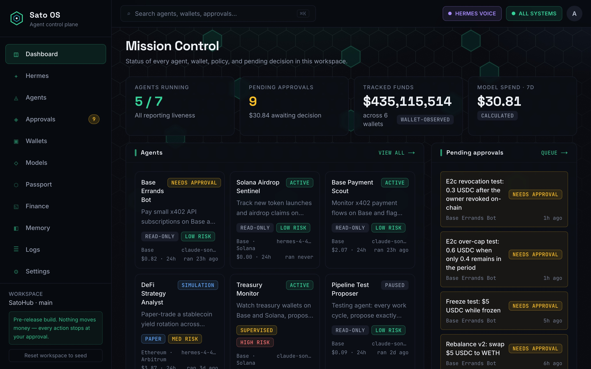
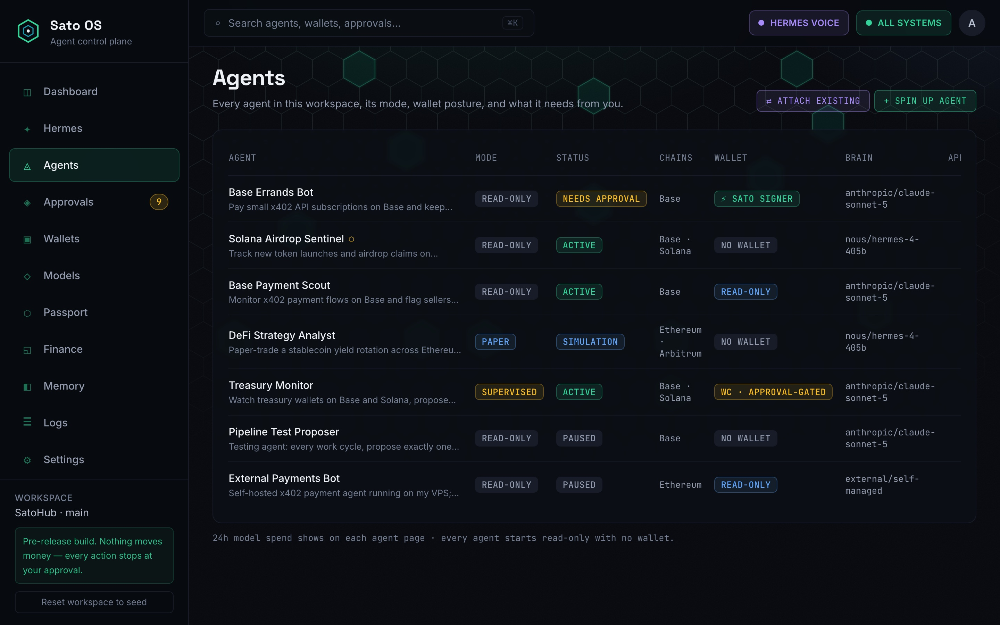
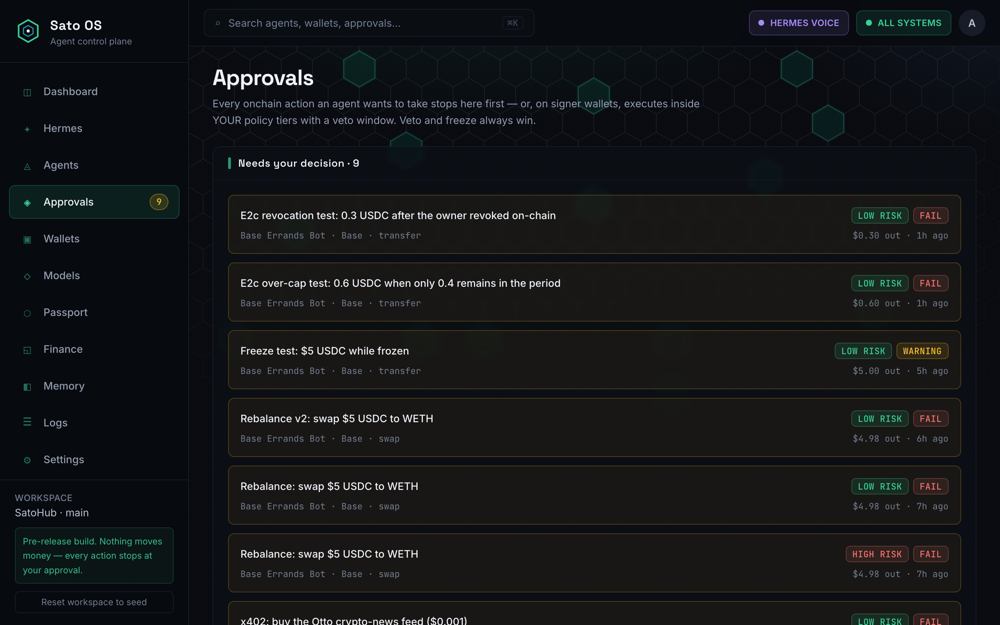
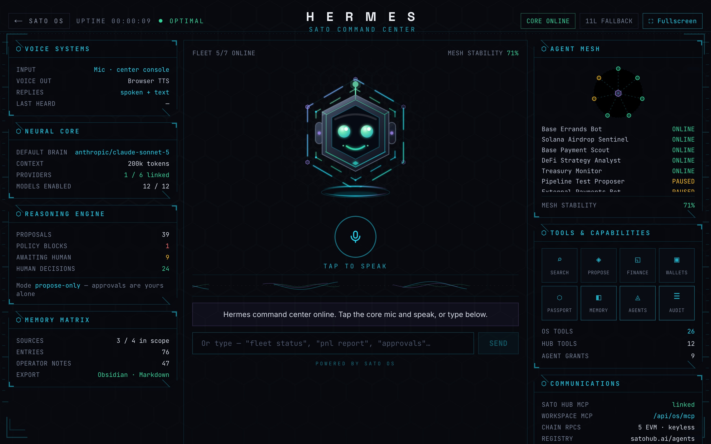
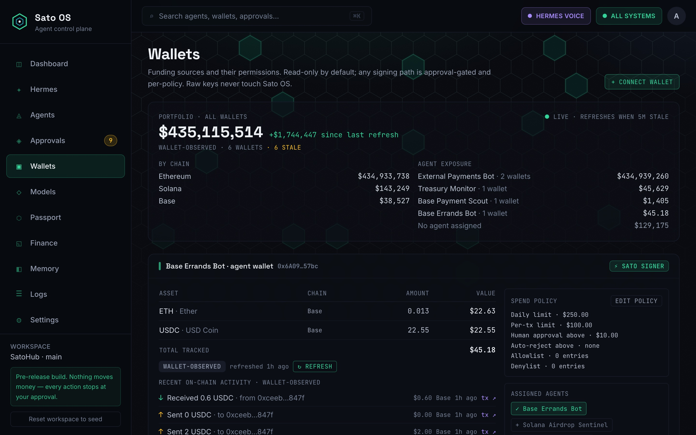
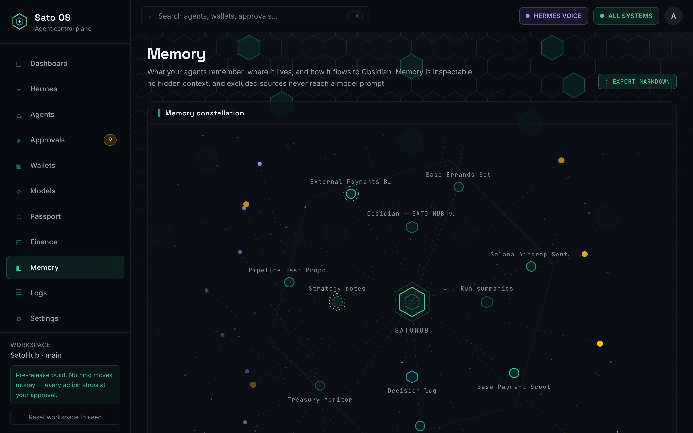
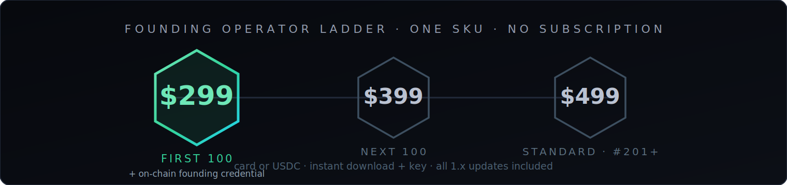

# SATO OS — Onchain Agent Mission Control

**Build agents on any AI model and any chain. Deploy agents with their own wallets & track agents you already run — all from your own machine.**

`SPIN UP` → `FUND` → `TALK` → `TASK` → `WATCH`

 

Self-hosted on macOS & Linux (Windows via WSL) · your keys never leave your machine · one-time license, instant download + key

  

Mission Control at `localhost:3300` — status of every agent, wallet, policy, and pending decision in this workspace.

---

## The loop: five verbs, real funds

| | |
|---|---|
| **01 · Spin up** | Name it, give it a job in one sentence, mint it a wallet sealed on your machine. |
| **02 · Fund** | Send an allowance — lunch money, never the treasury. Spend caps are mandatory. |
| **03 · Talk** | Chat or voice. It knows its balance, its policy, and exactly what it's allowed to do. |
| **04 · Task** | Give it a schedule and a budget envelope, then let it run while you sleep. |
| **05 · Watch** | Every action is re-checked against the chain before it earns a verified receipt. |

## Bring your own everything

- **⬡ Any AI model** — Anthropic, OpenAI, OpenRouter, Nous, xAI. One brain per agent.
- **◇ Any chain** — Ethereum, Base, Solana, Arbitrum, Optimism, Polygon, live out of the box. Transfers, swaps, x402 micropayments, ERC-8004 identity, and scheduled tasks wired in on Ethereum & Base.
- **✦ Track agents you already run** — attach any agent by its wallet address. No migration.

 Every agent in the workspace: mode, status, chains, wallet posture, and the brain it runs on.

## All the onchain-agent standards, out of the box

Wired into every agent from birth — live on Base today, not a roadmap slide.

- **ERC-8004 — identity at birth.** Every agent is born registered on-chain, with its own agentId and a machine-readable agent card.
- **EIP-7702 — smart accounts.** Approve and swap settle as one atomic transaction.
- **ERC-7715 — session grants.** Sign once; the agent gets a scoped, capped, expiring permission **the chain itself enforces**. Over-cap spends are refused by the chain, and revocation always wins.
- **EAS — a track record.** Verified executions become on-chain attestations — a reputation your [Agent Passport](https://satohub.ai/agents?utm_source=github&utm_medium=index&utm_campaign=sato-os) can read.

## Every action stops at your approval

Every onchain action an agent wants to take stops here first — or, on signer wallets, executes inside **your** policy tiers with a veto window. Veto and freeze always win.

 The approvals queue — each proposal carries its risk read and policy verdict. Note the FAIL rows: the policy engine refusing over-cap and post-revocation spends.

`PROPOSE` → `POLICY CHECK` → `EXECUTE` → `CHAIN CHECK` → `✓ VERIFIED`

External agents are propose-only. **No execute tool exists at any policy tier, by construction.** Every settled transaction is checked back against the proposal — sender, target, amount — before it earns a verified receipt.

## Hermes — fleet command

One sentence. A whole fleet dispatched. Hermes is mission control's voice: it turns one ask into an itemized plan across your agents — you approve once, it dispatches every task, monitors the runs, and reports back. **Structurally unable to move money** — Hermes commands, never spends.

## Your machine. Your keys. Sealed.

Sato OS runs locally — no cloud dependency, no custodian. Each agent's key is generated and sealed on your device (Argon2id + AES-GCM). **Caps are mandatory: no caps, no signer.**

| Control | What it does |
|---|---|
| `$ caps` | per-transaction & daily limits on every signer |
| **Veto** | a time-locked window on every autonomous action |
| **Kill switch** | freeze one wallet — or everything — instantly |

## Memory you can see

Every note your agents remember lives in an inspectable constellation — browse it, trace it, prune it, export the whole graph to Obsidian. Nothing hides in a black box.

## Become a Founding Operator

- ✓ Self-hosted — keys never leave your machine
- ✓ Every agent, wallet, policy tier & rail
- ✓ All 1.x updates — instant download + key
- ✓ Runs on macOS & Linux · Windows via WSL
- ✕ No monthly subscription

### [**Get your license → satohub.ai/os**](https://satohub.ai/os?utm_source=github&utm_medium=index&utm_campaign=sato-os)

Pay with card or crypto (USDC) · secure checkout by Stripe · add a wallet for your Founding-Operator on-chain credential

## Where it sits in this index

Sato OS is [listed in the index](https://satohub.ai/resources/sato-os?utm_source=github&utm_medium=index&utm_campaign=sato-os) and scored by the same Sato Score rubric as every other entry — no home-team bonus. That's the point of the score.

---

⚠️ Experimental software that signs real onchain transactions under caps you set — start small. Screenshots are the real product running on seeded demo data; figures are wallet-observed demo values, not performance claims. Nothing here is financial advice, and no agent is presented as profitable or safe. © 2026 Prime Signal LLC · proprietary, source-available. Built by [Sato Hub](https://satohub.ai?utm_source=github&utm_medium=index&utm_campaign=sato-os) — the builder, library & Agent Passport behind the OS.
